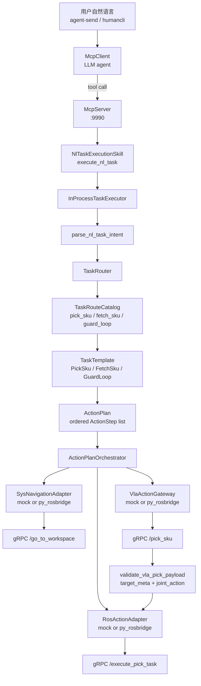

# Agentos 语意推理解析与任务匹配架构设计 v1

> 状态：当前实现对齐版（2026-06）  
> 用途：面向技术评审和 SDK 提供方，对齐 dimos 侧 **自然语言 -> 任务路由 -> ActionPlan -> 编排执行 -> VLA/ROS 服务** 的真实实现。  
> 关联文档：`vla_execution_mvp_plan.md`（历史路线图）、`vla_pick_sku_contract.md`（早期 contract 草案）、`dimos/agents/vla_pick_cli.md`（当前联调命令速查）。

---

## 1. 结论

VLA Pick 当前不是让 LLM 直接控制机械臂，也不是让 VLA 服务直接吃自然语言。当前主链路是：

```text
用户自然语言
  -> McpClient 选择统一工具 execute_nl_task
  -> TaskRouter 识别 pick_sku / fetch_sku / guard_loop
  -> TaskTemplate 生成 ActionPlan
  -> ActionPlanOrchestrator 顺序执行
  -> py_rosbridge gRPC 调用 sys / VLA / ROS 服务
```

核心分工：

- LLM 只负责把用户请求交给统一 MCP tool：`execute_nl_task(text: str, request_id: str = "")`。
- dimos 负责任务白名单、槽位校验、ActionPlan 编排、VLA 输出校验和 ROS 转发门禁。
- SDK 侧提供远程能力：系统导航、VLA pick 推理、ROS 动作执行。
- pick 不是独立 skill，而是统一 route catalog 里的一个 route。

当前正常 MCP 暴露面只应该看到 `execute_nl_task`。旧的 `plan_pick_instruction` 和 `execute_pick_instruction` 不再作为 agent 可调用入口。

---

## 2. 当前实现边界

| 边界             | 当前职责                             | 主要代码                                                                                      | 对 SDK 的含义                                   |
| -------------- | -------------------------------- | ----------------------------------------------------------------------------------------- | ------------------------------------------- |
| Agent / MCP    | 让 LLM 调统一 tool，不暴露 pick 专用入口     | `dimos/agents/dax_agent.py`, `dimos/agents/dax_agent_system_prompt.py`                | SDK 不需要理解 prompt，只需保证工具调用后的服务可用             |
| NL Task 路由     | 解析自然语言 intent，做白名单 route 校验      | `dimos/agents/skills/nl_task_execution_skill.py`, `dimos/agents/skills/nl_task_router.py` | SDK 不接收自然语言，只接收结构化字段                        |
| ActionPlan     | 把任务展开为确定性步骤                      | `dimos/agents/skills/task_action_plan.py`                                                 | SDK 要清楚每个 step 调哪个服务                        |
| Sys Navigation | 导航到指定工作区                         | 暂无，仿真真值模拟                                                                                 | 提供 `/go_to_workspace`                       |
| VLA Pick       | 根据 workspace/sku 做视觉动作推理或远端 pick | 仿真                                                                                        | 提供 `/pick_sku`，并返回可校验 payload               |
| Validation     | 校验 VLA 输出目标和动作载荷                 | 暂无                                                                                        | `target_meta` 和 `joint_action` 是关键 contract |
| ROS Action     | 提交已校验动作                          | 暂无                                                                                        | 提供 `/execute_pick_task`                     |
| Adapter 装配     | mock / py_rosbridge 切换           | `vla_pick_adapter_factory.py`                                                             | 联调时通过环境变量切换真实服务                             |

当前通信是 py_rosbridge gRPC。mock adapter 用于本地单测和无硬件联调。

---

## 3. 总体架构



Blueprint 入口在 `dimos/agents/dax_agent.py`：

```python
dax_agent = autoconnect(
    NlTaskExecutionSkill.blueprint(action_orchestrator=make_action_plan_orchestrator()),
    McpServer.blueprint(),
    McpClient.blueprint(model="deepseek-v4-pro", system_prompt=DAX_AGENT_SYSTEM_PROMPT),
)
```

这个 blueprint 只挂统一 NL 入口、MCP server 和 MCP client。它没有再挂 pick 专用 semantic mapping skill 或 pick execution skill。

---

## 4. 统一 NL Task 入口

### 4.1 唯一正常 MCP tool

`NlTaskExecutionSkill` 暴露的 tool 是：

```python
@skill
def execute_nl_task(self, text: str, request_id: str = "") -> SkillResult[Any]:
    return self._executor.execute_text(text, request_id=request_id)
```

它的职责不是执行某一个 pick 函数，而是把自然语言任务送入统一任务链路：

```text
execute_nl_task
  -> InProcessTaskExecutor.execute_text
  -> parse_nl_task_intent
  -> TaskRouter.route
  -> compose_action_plan
  -> route_handlers["action_plan"]
  -> ActionPlanOrchestrator.run
```

### 4.2 Route catalog

当前 `TaskRouteCatalog` 保留三类 route：

| intent | route name | template | ActionPlan 行为 |
|--------|------------|----------|-----------------|
| `pick_sku` | `vla_pick_sku` | `PickSkuTemplate` | `move_to_workspace -> vla_pick_sku` |
| `fetch_sku` | `fetch_sku` | `FetchSkuTemplate` | `move_to_workspace(source) -> vla_pick_sku -> move_to_workspace(target) -> vla_drop_sku` |
| `guard_loop` | `guard_loop` | `GuardLoopTemplate` | 有限次展开导航循环，不调用 VLA |

这里的 route name `vla_pick_sku` 是内部路由名，不是 MCP tool 名。agent 不应该直接看到或调用它。

### 4.3 为什么不恢复 pick 专用入口

pick 专用入口的问题是会让 LLM 绕过通用任务路由：

- 绕过 `TaskRouter` 后，pick/fetch/guard 的扩展方式不一致。
- 绕过 `TaskTemplate` 后，任务步骤无法统一表达为 `ActionPlan`。
- 绕过 `ActionPlanOrchestrator` 后，失败门禁和 metadata 追踪会分裂。
- 后续新增 drop、scan、inspect 等任务时，会继续堆新的 MCP tool，泛化性变差。

所以当前设计要求：正常用户请求，包括 pick、fetch、guard，都必须通过 `execute_nl_task`。

---

## 5. Pick SKU 端到端链路

以用户输入为例：

```text
去蓝色桌子的工作区，抓取红色 cube
```

### 5.1 intent 解析

`parse_nl_task_intent` 最终生成类似结构：

```json
{
  "request_id": "req-...",
  "raw_instruction": "去蓝色桌子的工作区，抓取红色 cube",
  "intent_type": "pick_sku",
  "slots": {
    "workspace_name": "table",
    "workspace_color": "blue",
    "sku_name": "cube",
    "sku_color": "red"
  }
}
```

pick 的底层槽位解析仍复用 `vla_pick_semantic_mapping.py` 里的内部 helper，例如 `parse_pick_instruction`。这些 helper 是内部解析和测试能力，不是 agent tool。

### 5.2 ActionPlan 展开

`PickSkuTemplate` 把 intent 展开为两个步骤：

```json
{
  "request_id": "req-...",
  "intent_type": "pick_sku",
  "template": "pick_sku_template",
  "steps": [
    {
      "step_id": "step-1",
      "executor": "sys_navigation",
      "action_type": "move_to_workspace",
      "args": {
        "workspace_name": "table",
        "workspace_color": "blue"
      }
    },
    {
      "step_id": "step-2",
      "executor": "vla",
      "action_type": "vla_pick_sku",
      "args": {
        "workspace_name": "table",
        "workspace_color": "blue",
        "sku_name": "cube",
        "sku_color": "red"
      },
      "depends_on": ["step-1"]
    }
  ]
}
```

### 5.3 编排执行

`ActionPlanOrchestrator.run()` 按步骤顺序执行：

1. `sys_navigation` step 调 `navigate_to_workspace`。
2. 如果导航状态不是 `arrived`，立刻失败返回，不调用 VLA。
3. `vla` step 调 `VlaActionGateway.execute`。
4. `VlaActionGateway` 将 `vla_pick_sku` 转成 `VlaPickRequest` 并调用 VLA client。
5. VLA 返回成功且通过 `validate_vla_pick_payload` 后，metadata 中出现 `validated_payload`。
6. 只有存在 `validated_payload` 时，才调用 ROS adapter 的 `submit_action`。
7. 全部完成后返回 `SkillResult.ok`，metadata 包含 `intent`、`route`、`action_plan`、`phase="SUCCEEDED"`。

关键安全门：

```text
navigation failed -> 不调用 VLA
VLA validation failed -> 不调用 ROS
missing joint_action -> 不调用 ROS
ROS submit failed -> 整体失败
```

---

## 6. SDK / 服务接口对齐

当前 SDK 对齐重点不是 HTTP API，而是 rosbridge gRPC 后面的 ROS service contract。

| 服务                   | 当前调用方                             | 当前提供方     | dimos 输入语义                                                           | 期望输出语义                                                    | 失败语义                                               |
| -------------------- | --------------------------------- | --------- | -------------------------------------------------------------------- | --------------------------------------------------------- | -------------------------------------------------- |
| `/go_to_workspace`   | `PyRosbridgeSysNavigationAdapter` | sys / SDK | `workspace_name`, `workspace_color`                                  | 到达指定工作区，返回 success/status                                 | timeout 或 response.success=false 时，dimos 停止后续步骤    |
| `/pick_sku`          | `PyRosbridgeVlaPickClient`        | VLA / SDK | `workspace_name`, `workspace_color`, `sku_name`, `sku_color`, `side` | 返回可校验 pick payload，理想情况下包含 `target_meta` 和 `joint_action` | 服务失败映射为 `VLA_EXECUTION_FAILED` 或 `VLA_UNAVAILABLE` |
| `/execute_pick_task` | `PyRosbridgeRosActionAdapter`     | ROS / SDK | 来自 VLA 的已校验 payload                                                  | 执行动作并返回 success/status                                    | rejected/failed/timeout 时，dimos 返回 ROS 阶段失败        |

配置中的默认 service type：

| 配置字段 | 默认值 |
|----------|--------|
| `ROS_GO_TO_WORKSPACE_SERVICE` | `/go_to_workspace` |
| `ROS_GO_TO_WORKSPACE_SERVICE_TYPE` | `dax_dimos_interfaces/srv/GoToWorkspace` |
| `ROS_PICK_SKU_SERVICE` | `/pick_sku` |
| `ROS_PICK_SKU_SERVICE_TYPE` | `dax_dimos_interfaces/srv/PickSku` |
| `ROS_EXECUTE_PICK_TASK_SERVICE` | `/execute_pick_task` |
| `ROS_EXECUTE_PICK_TASK_SERVICE_TYPE` | `dax_dimos_interfaces/srv/ExecutePickTask` |

### 6.1 `/go_to_workspace`

dimos 调用参数来自 `ActionStep.args`：

```text
workspace_name = "table"
workspace_color = "blue"
```

SDK 侧需要保证：

- 能按 `workspace_name + workspace_color` 唯一定位工作区。
- 到达成功时 response success 为 true，并提供可读 status。
- 失败时返回明确 failure reason，便于 dimos metadata 追踪。

### 6.2 `/pick_sku`

dimos 调用参数来自 `VlaPickRequest`：

```text
workspace_name = request.workspace_type
workspace_color = request.table_color
sku_name = request.object_type
sku_color = request.object_color
side = VLA_ROS_PICK_SIDE
```

SDK 侧需要对齐：

- `/pick_sku` 到底是“只做 VLA 推理”，还是“远端已经完成 pick”。
- 如果它要让 dimos 继续调用 `/execute_pick_task`，必须返回 `joint_action`。
- 如果它只返回远端已完成状态但没有 `joint_action`，当前 dimos 会把结果标记为 `ros_pick_completed=True`、`validation_passed=False`，不会再转发 ROS。

### 6.3 `/execute_pick_task`

dimos 只在存在已校验 payload 时调用：

```text
validated_payload -> build_execute_pick_task_request -> /execute_pick_task
```

SDK 侧需要保证：

- `/execute_pick_task` 能从 VLA payload 中解析出执行动作所需字段。
- response success 表示动作已被接受并执行成功。
- rejected、failed、timeout 要有可读状态，便于评审和日志定位。

---

## 7. Payload Contract

### 7.1 字段映射

dimos 内部语义和 ROS service 字段 intentionally 分离：

| 语义 | dimos 内部 | service 字段 |
|------|------------|--------------|
| 工作区类型 | `workspace_type` / `workspace_name` | `workspace_name` |
| 工作区颜色 | `table_color` / `workspace_color` | `workspace_color` |
| SKU 类型 | `object_type` / `sku_name` | `sku_name` |
| SKU 颜色 | `object_color` / `sku_color` | `sku_color` |

历史代码里 `VlaPickRequest.service_payload()` 仍表达了这层转换思想。当前 py_rosbridge adapter 使用 `build_pick_sku_request()` 构造 service request。

### 7.2 VLA 回包最低要求

理想 VLA payload 至少包含：

```json
{
  "request_id": "req-...",
  "target_meta": {
    "object_type": "cube",
    "object_color": "red",
    "table_color": "blue"
  },
  "joint_action": {
    "left_arm": [1.0]
  }
}
```

`target_meta` 的作用是证明 VLA 实际 pick 的对象和 dimos 请求一致。`joint_action` 的作用是给 ROS 执行层一个可以提交的动作载荷。

### 7.3 原样转发约束

当前设计要求：

```text
validation_passed_payload == ros_submitted_payload
```

含义：

- dimos 可以校验 payload。
- dimos 不应该在校验后私自改写 `target_meta` 或 `joint_action`。
- 评审时要能从 metadata 里追踪：VLA 通过校验的 payload 和 ROS 收到的 payload 是同一个语义对象。

### 7.4 RobotWin 兼容层

`vla_pick_output_receiver.py` 里有对 RobotWin 风格回包的 normalization。这个兼容层用于 MVP 联调，不应该被 SDK 当成长期 contract。

长期建议：SDK 明确稳定 schema，由 dimos 删除或收窄兼容分支。

---

## 8. Adapter 与配置

Adapter factory 根据 `GlobalConfig` 选择 mock 或 py_rosbridge：

```text
VLA_SYS_NAV_ADAPTER=mock|py_rosbridge
VLA_PICK_ADAPTER=mock|py_rosbridge
VLA_ROS_ADAPTER=mock|py_rosbridge
```

如果任一 adapter 使用 `py_rosbridge`，`make_action_plan_orchestrator()` 会创建共享 `RosbridgeSession`，避免每个 adapter 独立建连接。

常用联调配置：

```bash
VLA_PICK_ADAPTER=py_rosbridge
VLA_ROS_ADAPTER=py_rosbridge
VLA_SYS_NAV_ADAPTER=py_rosbridge
ROSBRIDGE_GRPC_TARGET=10.69.6.121:9091
ROSBRIDGE_READY_TIMEOUT_S=10
ROS_ACTION_TIMEOUT_S=30
```

本地 mock 联调：

```bash
VLA_PICK_ADAPTER=mock
VLA_ROS_ADAPTER=mock
VLA_SYS_NAV_ADAPTER=mock
```

当前 `GlobalConfig` 默认值里，`VLA_PICK_ADAPTER` 默认是 `py_rosbridge`，`VLA_ROS_ADAPTER` 和 `VLA_SYS_NAV_ADAPTER` 默认是 `mock`。实际联调时以 `.env` 或启动环境变量为准。

---

## 9. 错误处理与安全门

| 场景 | 典型 error/status | 当前行为 | 评审关注点 |
|------|-------------------|----------|------------|
| 缺少必要槽位 | `NEED_CLARIFICATION` | 不生成可执行任务 | 用户要补充颜色、目标或循环次数 |
| 槽位不合法 | `INVALID_SLOT` | 不调用服务 | catalog 和 SDK 支持范围要一致 |
| intent 不在白名单 | `UNSUPPORTED_INTENT` | 不执行 | 新任务必须先进入 route catalog |
| route 没 handler | `ROUTE_NOT_CONFIGURED` | 不执行 | 说明代码装配不完整 |
| 导航失败 | `NAVIGATION_FAILED` / `NAVIGATION_TIMEOUT` | 不调用 VLA | sys navigation 必须给清楚失败原因 |
| VLA 服务不可用 | `VLA_UNAVAILABLE` | 不调用 ROS | gRPC timeout 要能定位远端服务 |
| VLA 执行失败 | `VLA_EXECUTION_FAILED` | 不调用 ROS | SDK failure reason 要可读 |
| VLA payload 不合法 | `VLA_OUTPUT_INVALID` | 不调用 ROS | `target_meta` / `joint_action` contract 不满足 |
| 缺少 `joint_action` | `validation_passed=False` | 不调用 ROS | 需要确认 `/pick_sku` 是远端完成还是只返回推理 |
| ROS 提交失败 | `ROS_ACTION_FAILED` / `ROS_ACTION_TIMEOUT` | 整体失败 | `/execute_pick_task` 要提供稳定状态 |

安全门的设计原则是失败早返回：

```text
能不动机器人就不动机器人。
能在 dimos 层拒绝就不打到 VLA。
能在 VLA 校验层拒绝就不打到 ROS。
```

---

## 10. 当前限制与历史包袱

### 10.1 `vla_drop_sku` via rosbridge 尚未实现

`FetchSkuTemplate` 已经能把 fetch 展开到 drop step：

```text
move_to_workspace(source)
  -> vla_pick_sku
  -> move_to_workspace(target)
  -> vla_drop_sku
```

但 `PyRosbridgeVlaPickClient.execute_action_list()` 当前对 drop 返回：

```text
vla_drop_sku via rosbridge is not implemented.
```

所以 fetch 的 pick 前半段可以复用，drop 阶段需要后续 SDK contract。

### 10.4 `/pick_sku` 的语义需要进一步定稿

当前代码允许一种兼容结果：`/pick_sku` 服务成功，但 payload 没有 `joint_action`。这种情况下 dimos 会认为远端 pick 已完成，但不会继续调用 `/execute_pick_task`。

评审时必须确认：

- `/pick_sku` 是否应该只返回 VLA 推理动作。
- `/pick_sku` 是否已经在远端完成抓取。
- 如果远端已完成，`/execute_pick_task` 是否还需要存在于 pick 主链路。
- 如果要保留 dimos 转发 ROS，则 `joint_action` 必须成为稳定字段。

---

## 11. 技术评审清单

### 11.1 dimos 侧 reviewer 检查项

- MCP tool list 是否只暴露 `execute_nl_task`。
- `dax_agent.py` 是否只组合 `NlTaskExecutionSkill + McpServer + McpClient`。
- `NlTaskExecutionSkill` 是否只注册 `"action_plan"` handler。
- `TaskRouteCatalog` 是否包含 `pick_sku / fetch_sku / guard_loop`。
- pick 是否通过 `PickSkuTemplate -> ActionPlanOrchestrator` 执行。
- 导航失败时是否没有 VLA 调用。
- VLA mismatch 或 payload invalid 时是否没有 ROS 调用。
- 成功 metadata 是否包含 `intent`、`route`、`action_plan`、`phase="SUCCEEDED"`。
- `validated_payload` 是否按原样交给 ROS adapter。

### 11.2 SDK 提供方对齐问题

- `/go_to_workspace` 的 request/response schema 是否已经冻结。
- `/pick_sku` 是否保证返回稳定 `target_meta`。
- `/pick_sku` 是否保证返回稳定 `joint_action`。
- `/pick_sku` 成功但无 `joint_action` 时，语义是“远端已完成 pick”还是“只完成识别”。
- `/execute_pick_task` 的输入是否等价于 VLA 的 `validated_payload`。
- 三个服务是否都带 request trace 信息，方便跨系统排查。
- timeout、retry、cancel 是否由 SDK 负责，还是由 dimos 负责。
- failure reason 是否有统一枚举，而不是只返回自由文本。
- RobotWin normalization 是否可以替换为正式 SDK schema。
- drop/fetch 的 SDK contract 何时补齐。

---

## 12. Smoke / 验收命令

启动 agent：

```bash
cd ~/Projects/dimos
source .venv/bin/activate
PYTEST_VERSION=1 dimos run dax-agent -d
```

确认 tool list：

```bash
dimos mcp list-tools
```

期望：正常任务入口只看到 `execute_nl_task`，不应看到 `plan_pick_instruction` 或 `execute_pick_instruction`。

发送 pick 任务：

```bash
dimos agent-send "去蓝色桌子的工作区，抓取红色 cube"
```

期望日志链路：

```text
execute_nl_task
  -> TaskRouter matched pick_sku
  -> PickSkuTemplate composed ActionPlan
  -> /go_to_workspace
  -> /pick_sku
  -> validate_vla_pick_payload
  -> /execute_pick_task  # only when validated_payload exists
```

不启动 agent，直接测远端 rosbridge：

```bash
.venv/bin/python scripts/probe_rosbridge_pick.py --step connect
.venv/bin/python scripts/probe_rosbridge_pick.py --step go_to_workspace
.venv/bin/python scripts/probe_rosbridge_pick.py --step pick_sku
.venv/bin/python scripts/probe_rosbridge_pick.py --step execute_pick_task
.venv/bin/python scripts/probe_rosbridge_pick.py --step all
```

建议评审前至少保留三份证据：

- `dimos mcp list-tools` 的 tool list 截图或日志。
- 一次成功 pick 的 agent 日志。
- 一次 `probe_rosbridge_pick.py --step all` 的远端服务结果。

---

## 13. 代码索引

| 文件 | 作用 |
|------|------|
| `dimos/agents/dax_agent.py` | dax-agent blueprint |
| `dimos/agents/dax_agent_system_prompt.py` | 约束 LLM 使用 `execute_nl_task` |
| `dimos/agents/skills/nl_task_execution_skill.py` | MCP skill 入口 |
| `dimos/agents/skills/nl_task_router.py` | intent parser、route catalog、executor |
| `dimos/agents/skills/task_action_plan.py` | TaskTemplate、ActionPlan、ActionPlanOrchestrator |
| `dimos/agents/skills/vla_pick_adapter_factory.py` | mock / py_rosbridge adapter 装配 |
| `dimos/agents/skills/rosbridge_session.py` | 共享 py_rosbridge gRPC client session |
| `dimos/agents/skills/py_rosbridge_nav_adapter.py` | `/go_to_workspace` adapter |
| `dimos/agents/skills/py_rosbridge_vla_adapter.py` | `/pick_sku` adapter |
| `dimos/agents/skills/py_rosbridge_ros_adapter.py` | `/execute_pick_task` adapter |
| `dimos/agents/skills/vla_pick_output_receiver.py` | VLA payload 校验 |
| `dimos/agents/skills/vla_pick_semantic_mapping.py` | pick 内部槽位解析和测试 helper |
| `scripts/probe_rosbridge_pick.py` | 远端服务探针 |

