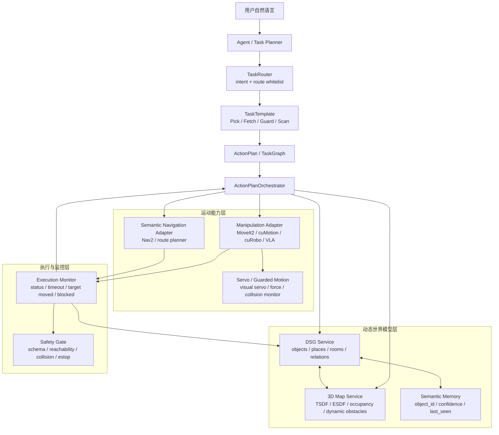

# 动态任务规划与 VLA/ROS 执行系统调研计划

> 状态：调研与架构演进建议（2026-06）  
> 目标读者：DimOS / VLA Pick 技术评审成员、SDK 提供方、导航与操作规划同事。  
> 核心问题：在机器人领域，如何把 **动态任务规划（Agent）**、**动态语义场景理解（DSG with 3D map）**、**动态语义导航**、**动态操作避障（with 3D map）** 做成可落地、可评审、可扩展的系统。

---

## 0. 摘要结论

比较稳妥的方案不是让一个大模型端到端直接控制机器人，而是采用分层混合架构：

```text
LLM Agent / Task Planner
  -> Dynamic Scene Graph / 3D Semantic World Model
  -> Semantic Navigation
  -> Manipulation Planning with 3D Map
  -> Execution Monitor / Replanning
```

对应到 DimOS，推荐演进路线是：

```text
execute_nl_task
  -> TaskRouter
  -> TaskTemplate
  -> ActionPlan / TaskGraph
  -> ActionPlanOrchestrator
  -> DSG Service
  -> 3D Map / ESDF Service
  -> Semantic Nav Adapter
  -> Manipulation / VLA / ROS Adapter
  -> Monitor
  -> Replan
```

一句话判断：

> Agent 做任务级决策，DSG 做世界模型，Nav2 / MoveIt2 / cuMotion / cuRobo 做几何规划与控制，DimOS Orchestrator 做安全门、状态追踪和失败重规划。

这和当前 VLA Pick 已经落地的统一入口方向一致。当前 `execute_nl_task -> TaskRouter -> TaskTemplate -> ActionPlan -> ActionPlanOrchestrator` 是合适的第一层骨架，下一步应补的是 DSG/3D Map 标准接口、语义导航接口、动态操作避障接口，而不是恢复 pick 专用入口。

---

## 1. 为什么机器人不能只靠 LLM 直接规划动作

用户会说：

```text
去蓝色桌子那里，把红色 cube 拿起来，避开路上的人。
```

这句话包含至少四层问题：

| 层级 | 问题 | 需要的能力 |
|------|------|------------|
| 任务层 | 要做什么，先后顺序是什么 | Agent / Task Planner |
| 语义层 | 蓝色桌子、红色 cube 在哪里，它们是否还存在 | DSG / semantic memory |
| 几何层 | 机器人能否到达，路径是否被挡住 | 3D map / costmap / ESDF |
| 控制层 | 机械臂怎么避障抓取，执行中是否安全 | motion planner / servo / ROS action |

LLM 擅长解释用户意图和生成高层计划，但它不擅长实时几何安全：

- 它不知道实时障碍物是否移动。
- 它无法保证轨迹不碰撞。
- 它不应该直接生成关节速度或关节轨迹。
- 它的输出需要被白名单、schema、world model 和 safety gate 约束。

因此系统应当拆成多层，每一层只做自己最擅长的事。

---

## 2. 推荐总体架构



这套架构的关键点：

- Agent 不直接控制机器人，只产出高层任务意图。
- DSG 是语义世界模型，回答“哪个对象、哪个区域、什么关系”。
- 3D Map / ESDF 是几何世界模型，回答“哪里可通行、哪里会碰撞、距离障碍多远”。
- 导航和操作规划都消费 3D Map，但用不同形式：
  - 导航更关心 2D/2.5D costmap、topological places、可达位姿。
  - 操作更关心局部 ESDF、障碍点云、机器人自碰撞、末端接近路径。
- Orchestrator 是跨模块的治理层，负责失败早返回、状态追踪、重规划和 payload 审计。

---

## 3. 技术路线调研

### 3.1 DSG / Dynamic Scene Graph

DSG 的作用是把机器人看到的世界从“点云和图像”提升为“对象、空间、关系、时间”的图结构。

一个典型 DSG 可以包含：

```text
building
  -> floor
    -> room
      -> place / navigable region
        -> object
          -> part / affordance
```

边可以表达：

- `inside(room, object)`
- `on(table, cube)`
- `near(robot, table)`
- `reachable(robot, place)`
- `observed_at(object, timestamp)`
- `moved_since(object, last_seen)`

#### Kimera

Kimera 提出了 3D Dynamic Scene Graph 作为机器人世界模型，把几何、语义、动态实体和层级空间组织在同一图里，并展示了 DSG 可用于实时层级语义路径规划。

适合借鉴的点：

- 分层图结构：object / room / building 等多尺度表示。
- 语义和几何一起保存，不把语义查询和路径规划割裂。
- 把人、物体、房间等动态或半动态实体放进同一世界模型。

工程启发：

- DimOS 可以先不完整复刻 Kimera，而是定义自己的 `DsgService` 接口。
- 第一版可以只支持 workspace、object、place、relation、timestamp。
- 后续再接入更强的 SLAM / segmentation / open-vocabulary mapping。

#### Hydra

Hydra 更强调实时构建和优化 3D Scene Graph。它用局部 ESDF 提取 topological places，并将 low-level perception、mid-level mapping 和 high-level graph construction 分层处理。

适合借鉴的点：

- DSG 不是离线标注图，而是机器人探索时增量构建的世界模型。
- ESDF 不只给避障，也可以服务 place extraction 和拓扑规划。
- 快慢两级 perception 很重要：底层几何要快，高层语义可以慢一些。

工程启发：

- DimOS 的 DSG 不应只是一张静态 YAML 场景表。
- 第一版可从静态 catalog 起步，但接口必须支持 `last_seen`、`confidence`、`stale`、`dynamic`。
- 3D Map 服务和 DSG 服务要能互相引用：DSG object node 需要对应 3D pose / bbox / mesh handle。

### 3.2 Open-Vocabulary 3D Scene Graph

VLA Pick 的自然语言对象目前比较窄：颜色桌子、颜色 cube。下一步如果要支持“靠门的箱子”“最左边的红色物体”“蓝桌旁边那个杯子”，就需要 open-vocabulary 语义能力。

#### ConceptGraphs

ConceptGraphs 的核心思路是：用 2D foundation models 抽取语义，再把多视角结果融合成 3D graph representation。它关注 open-vocabulary、对象关系和面向规划的紧凑表示。

适合借鉴的点：

- 不是在每个点上塞高维语言特征，而是形成对象级图结构。
- 支持语言 prompt 驱动的下游规划任务。
- 能把“物体之间的语义空间关系”作为规划输入。

工程启发：

- 对 DimOS 来说，open-vocabulary 语义不要直接进入执行层。
- 应先通过 DSG query 变成确定的 `object_id`、`pose`、`confidence`、`evidence`。
- 执行前必须把 open-vocabulary 结果冻结成可审计的结构化目标。

#### HOV-SG

HOV-SG 面向 language-grounded robot navigation，构建 floor、room、object 层级的 open-vocabulary 3D scene graph，适合大空间、跨楼层、抽象查询。

适合借鉴的点：

- 语言导航不能只做 dense feature map；层级图更适合长程任务。
- 大环境里需要 floor / room / object 层级，否则查询和规划成本会过高。
- 语义导航的目标不一定是物体，也可能是 room、area、floor。

工程启发：

- DimOS 的 `TaskRouter` 后续不应只解析 SKU，也应支持 place-level goal。
- `SemanticNavigationAdapter` 的目标类型应支持 `object_id`、`place_id`、`workspace_id`、`room_id`。
- guard_loop、fetch、inspect 等任务都可以从 DSG 中解析目标。

### 3.3 3D Map / ESDF

3D Map 是运动安全的几何底座。推荐把它和 DSG 分开，但保持引用关系。

典型表示：

| 表示 | 作用 |
|------|------|
| TSDF | 融合深度，重建表面 |
| ESDF / SDF | 查询到障碍物距离，用于避障和轨迹优化 |
| Occupancy grid / voxel | 判断占用和通行 |
| Mesh | 可视化、审计、离线分析 |
| 2D costmap slice | 给导航栈使用 |

#### nvblox

Isaac ROS Nvblox 是目前较实用的工程方案之一。它用深度图和位姿实时重建 3D 场景，并输出 2D costmap 给 Nav2；同时支持动态场景模式，例如 people reconstruction 和 dynamic reconstruction。

适合借鉴的点：

- 同一套 3D 重建可以服务导航 costmap 和操作避障。
- GPU 加速适合实时机器人。
- 支持 depth camera 和 3D LiDAR。

工程启发：

- DimOS 不一定要内置 nvblox，但应该抽象 `Map3DService`。
- 服务接口不要绑死具体实现，应暴露：
  - `get_esdf_region`
  - `get_costmap_slice`
  - `query_free_space`
  - `query_distance_to_obstacle`
  - `subscribe_dynamic_obstacles`
- 如果 SDK 同事已经有 3D map 能力，DimOS 只需要 adapter 和 contract。

### 3.4 语义导航

语义导航不是“LLM 告诉机器人往哪走”，而是：

```text
语言目标 -> DSG 解析 -> 可达位姿候选 -> Nav2 / planner 执行 -> monitor 重规划
```

#### Nav2

Nav2 是 ROS2 生态里成熟的导航框架。它使用 Behavior Trees 组织导航行为，包含 planner、controller、smoother、route、behavior servers，并支持动态避障、恢复行为、waypoint following 和生命周期管理。

适合借鉴的点：

- 导航行为用 BT / server 组合，不要写成一个单体函数。
- planner/controller/recovery 插件化，适合不同机器人底盘。
- costmap 可以来自 2D lidar、depth、3D map slice 或 semantic layer。

工程启发：

- DimOS 的语义导航 adapter 可以把 `object_id/place_id` 解析成 Nav2 goal pose。
- Nav2 的 BT 适合承接“到不了时换候选位姿”“被挡住时恢复”等逻辑。
- DimOS 不需要替代 Nav2，而应在上层做任务语义和状态治理。

### 3.5 动态操作避障

机械臂操作比导航更敏感，因为末端、手臂、自碰撞、夹爪、目标物、人体和桌面都可能成为约束。

推荐拆两层：

```text
global manipulation planning
  -> 生成可行抓取/放置轨迹

local guarded execution / servo
  -> 执行中根据视觉、力控、距离场做小范围修正和停止
```

#### MoveIt2

MoveIt2 是 ROS 机械臂规划的主流框架，适合作为通用 motion planning 和 planning scene 基座。

适合借鉴的点：

- planning scene 可以维护 robot、object、obstacle。
- collision checking、IK、trajectory execution 是成熟模块。
- 容易和 ROS2 action/service 集成。

#### MoveIt Servo

MoveIt Servo 用于实时伺服控制。官方文档说明它支持奇异点检查、碰撞检查、motion smoothing、关节位置和速度限制；接近奇异点或碰撞时会缩放速度。

适合借鉴的点：

- 对“抓取最后 10 cm”这类闭环动作很有价值。
- 可以和 VLA 输出的末端方向、视觉偏差、force feedback 结合。
- 它不是全局规划器，更像局部安全执行器。

#### cuMotion / cuRobo

cuMotion 是 Isaac ROS 提供的 CUDA 加速操作规划能力，可以集成到 MoveIt2，生成平滑、避障轨迹，并可结合 nvblox 的 SDF 做障碍物感知规划。cuRobo 论文展示了 GPU 并行轨迹优化、快速 IK 和 collision-free motion generation 的潜力。

适合借鉴的点：

- 如果项目硬件有 NVIDIA GPU，cuMotion / cuRobo 是动态避障操作的强候选。
- SDF/ESDF 直接进入 trajectory optimization，适合 cluttered scenes。
- 与 Isaac Sim / Isaac ROS 生态配合更自然。

工程启发：

- DimOS 层不要绑定 MoveIt2 或 cuMotion 的具体 API。
- 应定义 `ManipulationPlannerAdapter`：
  - 输入：目标 object、grasp constraint、3D map handle、safety policy。
  - 输出：trajectory / action payload / execution handle。
- VLA 可以作为 grasp proposal 或 policy source，但 ROS/MoveIt/cuMotion 仍应做安全执行。

---

## 4. 方案对比

### 4.1 方案 A：LLM 直接生成动作

```text
NL -> LLM -> joint action / velocity command
```

不推荐。

优点：

- demo 看起来快。
- 组件少。

问题：

- 轨迹安全不可证明。
- 实时世界状态缺失。
- 无法稳定处理动态障碍。
- 难以审计为什么动了。
- 很难通过技术评审和真实机器人安全评审。

适用范围：

- 只能用于离线仿真玩具 demo，不适合作为 DimOS 主架构。

### 4.2 方案 B：LLM + 工具调用 + 传统导航/操作

```text
NL -> Agent -> tool calls -> Nav2 / MoveIt2 / ROS
```

这是可落地的工程 MVP。

优点：

- 复用 ROS 生态。
- 易于接入现有导航和操作模块。
- 比端到端 LLM 安全很多。

问题：

- 如果没有 DSG，语义目标解析会弱。
- 如果没有 3D Map，动态操作避障能力有限。
- Agent 容易退化成“调工具脚本”，长期扩展性不足。

适用范围：

- 当前 VLA Pick 所在阶段。
- 适合把 pick/fetch/guard 稳住。

### 4.3 方案 C：Agent + DSG + 3D Map + 插件化运动栈

```text
NL
  -> Agent / TaskGraph
  -> DSG query
  -> 3D Map / ESDF
  -> Semantic Nav
  -> Manipulation Planning
  -> Execution Monitor
  -> Replan
```

推荐作为 DimOS 中期架构。

优点：

- 语义、几何和执行责任清楚。
- 支持动态环境和长期任务。
- 适合技术评审：每层都有 contract、输入输出和失败语义。
- 可以渐进接入现有 SDK，不需要一次性重写全部系统。

问题：

- 接口设计成本较高。
- DSG 和 3D map 的一致性需要工程治理。
- 需要可观测性：object_id、map_version、plan_id、evidence 必须能追踪。

建议：

- DimOS 选择方案 C 作为目标架构。
- 短期从方案 B 平滑升级，不做大爆炸重构。

---

## 5. DimOS 目标架构

### 5.1 模块划分

建议新增或明确以下逻辑模块：

| 模块 | 类型 | 职责 |
|------|------|------|
| `NlTaskExecutionSkill` | Skill | 当前统一自然语言入口 |
| `TaskRouter` | library / service | intent 解析、白名单 route |
| `TaskTemplate` | library | 把 intent 展开为 ActionPlan |
| `ActionPlanOrchestrator` | module / library | 执行步骤、失败门禁、metadata |
| `DsgService` | Module | 语义世界模型查询和更新 |
| `Map3DService` | Module | TSDF/ESDF/costmap/dynamic obstacles |
| `SemanticNavigationAdapter` | Adapter | object/place/room -> reachable nav goal |
| `ManipulationPlannerAdapter` | Adapter | grasp/place/avoidance planning |
| `ExecutionMonitor` | Module | 状态监控、target moved、blocked、timeout |
| `ReplanPolicy` | library | 判断是否重规划、重试、终止 |

### 5.2 数据流

```text
1. 用户输入自然语言
2. execute_nl_task 生成 TaskIntent
3. TaskRouter 匹配 route
4. TaskTemplate 生成 ActionPlan / TaskGraph
5. Orchestrator 执行 step
6. 如果 step 需要语义目标：
     query DSG
7. 如果 step 需要可达位姿：
     query DSG + Map3D
8. 如果 step 是导航：
     call SemanticNavigationAdapter
9. 如果 step 是操作：
     call ManipulationPlannerAdapter / VLA / ROS
10. ExecutionMonitor 订阅执行状态和世界变化
11. 如果目标移动、路径阻塞、payload mismatch：
     fail early 或 replan
```

### 5.3 为什么 DSG 和 Map3D 要分开

DSG 回答语义问题：

```text
红色 cube 是哪个 object_id？
它在哪张桌子上？
它最后一次被看到是什么时候？
它和机器人之间有什么空间关系？
```

Map3D 回答几何问题：

```text
这个位姿是否被占用？
机械臂轨迹距离障碍多远？
桌子边缘在哪里？
局部 ESDF 是否足够新？
```

如果两者混在一起，会出现两个问题：

- 语义查询被几何表示拖慢。
- 几何安全被不稳定的语义标签污染。

推荐做法：

```text
DSG node:
  object_id: obj-red-cube-17
  class: cube
  color: red
  pose_ref: map/object_pose/...
  geometry_ref: map3d/bbox/...
  confidence: 0.92
  last_seen: timestamp
  map_version: map-123
```

这样 DSG 保存引用，Map3D 保存几何。

---

## 6. 核心接口建议

以下接口不是要求本轮立即实现，而是给 SDK 和 DimOS 对齐长期 contract。

### 6.1 `DsgService`

#### `resolve_semantic_target`

输入：

```json
{
  "request_id": "req-...",
  "query": "red cube on blue table",
  "constraints": {
    "object_type": "cube",
    "object_color": "red",
    "workspace_type": "table",
    "workspace_color": "blue"
  },
  "min_confidence": 0.7
}
```

输出：

```json
{
  "success": true,
  "target": {
    "object_id": "obj-red-cube-17",
    "class_name": "cube",
    "attributes": {
      "color": "red"
    },
    "pose": {
      "frame_id": "map",
      "position": [1.2, 0.5, 0.8],
      "orientation": [0.0, 0.0, 0.0, 1.0]
    },
    "support": {
      "workspace_id": "ws-blue-table-03",
      "relation": "on"
    },
    "confidence": 0.91,
    "last_seen": 1780000000.0,
    "map_version": "map-123"
  },
  "alternatives": []
}
```

失败语义：

| error_code | 含义 |
|------------|------|
| `TARGET_NOT_FOUND` | 找不到符合条件的对象 |
| `TARGET_AMBIGUOUS` | 多个候选且无法消歧 |
| `TARGET_STALE` | 目标太久未观测 |
| `WORLD_MODEL_UNAVAILABLE` | DSG 服务不可用 |

#### `get_reachable_places`

输入：

```json
{
  "request_id": "req-...",
  "target_id": "obj-red-cube-17",
  "robot_profile": "mobile_manipulator",
  "purpose": "pick"
}
```

输出：

```json
{
  "success": true,
  "places": [
    {
      "place_id": "place-blue-table-front-1",
      "pose": {
        "frame_id": "map",
        "position": [0.9, 0.3, 0.0],
        "orientation": [0.0, 0.0, 0.7, 0.7]
      },
      "score": 0.87,
      "reason": "front of blue table, arm can reach object"
    }
  ]
}
```

### 6.2 `Map3DService`

#### `query_free_space`

输入：

```json
{
  "request_id": "req-...",
  "frame_id": "map",
  "pose": {
    "position": [0.9, 0.3, 0.0],
    "orientation": [0.0, 0.0, 0.7, 0.7]
  },
  "robot_footprint": "base_default",
  "min_clearance_m": 0.15,
  "map_version": "map-123"
}
```

输出：

```json
{
  "success": true,
  "is_free": true,
  "min_distance_m": 0.32,
  "map_version": "map-123"
}
```

#### `get_local_esdf`

输入：

```json
{
  "request_id": "req-...",
  "center": [1.2, 0.5, 0.8],
  "size_m": [1.0, 1.0, 1.0],
  "resolution_m": 0.03,
  "map_version": "map-123"
}
```

输出：

```json
{
  "success": true,
  "esdf_ref": "map3d://esdf/map-123/region-456",
  "expires_at": 1780000002.0
}
```

关键原则：

- 大型 ESDF 不应直接塞进 Agent prompt。
- 大型 map data 应通过 reference / handle 传递。
- 执行前要记录 `map_version`，便于复盘。

### 6.3 `SemanticNavigationAdapter`

#### `navigate_to_semantic_target`

输入：

```json
{
  "request_id": "req-...",
  "target": {
    "type": "object",
    "object_id": "obj-red-cube-17"
  },
  "purpose": "pick",
  "candidate_places": [
    "place-blue-table-front-1",
    "place-blue-table-side-2"
  ],
  "policy": {
    "allow_replan": true,
    "max_replans": 2,
    "stop_if_target_moves": true
  }
}
```

输出：

```json
{
  "status": "arrived",
  "chosen_place_id": "place-blue-table-front-1",
  "final_pose": {
    "frame_id": "map",
    "position": [0.9, 0.3, 0.0],
    "orientation": [0.0, 0.0, 0.7, 0.7]
  },
  "map_version": "map-124"
}
```

### 6.4 `ManipulationPlannerAdapter`

#### `plan_and_execute_pick`

输入：

```json
{
  "request_id": "req-...",
  "target": {
    "object_id": "obj-red-cube-17",
    "class_name": "cube",
    "attributes": {
      "color": "red"
    }
  },
  "workspace": {
    "workspace_id": "ws-blue-table-03",
    "class_name": "table",
    "attributes": {
      "color": "blue"
    }
  },
  "geometry": {
    "map_version": "map-124",
    "esdf_ref": "map3d://esdf/map-124/region-456"
  },
  "constraints": {
    "avoid_dynamic_obstacles": true,
    "min_clearance_m": 0.03,
    "max_duration_s": 30.0
  }
}
```

输出：

```json
{
  "success": true,
  "execution_id": "exec-pick-001",
  "target_meta": {
    "object_id": "obj-red-cube-17",
    "object_type": "cube",
    "object_color": "red",
    "workspace_id": "ws-blue-table-03",
    "table_color": "blue"
  },
  "joint_action": {
    "trajectory_ref": "ros://trajectory/exec-pick-001"
  },
  "audit": {
    "planner": "cumotion",
    "map_version": "map-124",
    "validation_passed": true
  }
}
```

对当前 VLA Pick 的兼容关系：

- 当前 `/pick_sku` 可以看作 `plan_and_execute_pick` 的早期简化版。
- 如果 `/pick_sku` 只负责 VLA 推理，必须返回 `joint_action`。
- 如果 `/pick_sku` 已经远端完成执行，就应明确返回 `execution_id`、`completed=true`，避免 DimOS 再调 `/execute_pick_task`。

---

## 7. 动态重规划策略

动态机器人系统一定要回答：什么时候继续、什么时候停、什么时候重规划。

### 7.1 触发条件

| 触发条件 | 来源 | 建议行为 |
|----------|------|----------|
| 目标消失 | DSG target stale / not observed | 停止操作，重新 scan 或请求用户确认 |
| 多个目标 | DSG ambiguous | 返回澄清问题，不执行 |
| 目标移动 | object pose changed beyond threshold | 停止当前操作，重新规划 pick |
| 导航路径阻塞 | Nav2 blocked / costmap update | 换候选 place 或 recovery |
| 操作空间出现动态障碍 | ESDF / collision monitor | 降速、暂停或重新规划 |
| VLA payload mismatch | target_meta 不一致 | 拒绝转发 ROS |
| 地图版本过旧 | map_version mismatch | 重新 query Map3D |
| 执行超时 | action timeout | cancel action，进入 recovery |

### 7.2 重规划级别

| 级别 | 示例 | 处理 |
|------|------|------|
| L0 retry | gRPC transient failure | 同一 step 重试一次 |
| L1 local replan | 路径被临时挡住 | Nav2 recovery 或换局部路径 |
| L2 semantic replan | 目标位置变了 | 重新 query DSG，更新目标 pose |
| L3 task replan | 目标不存在或任务条件变化 | 回到 Agent / TaskRouter |
| L4 abort | 安全风险、用户取消、急停 | 停止并返回失败 |

### 7.3 Orchestrator 元数据要求

每次执行都应保留：

```json
{
  "request_id": "req-...",
  "intent": {},
  "route": {},
  "action_plan": {},
  "world_model": {
    "dsg_version": "dsg-10",
    "map_version": "map-124",
    "target_id": "obj-red-cube-17"
  },
  "execution": {
    "phase": "vla_pick_sku",
    "attempt": 1,
    "replan_count": 0
  },
  "evidence": {
    "target_meta": {},
    "validated_payload": {},
    "ros_submitted_payload": {}
  }
}
```

目标是让评审时能回答：

- 为什么选这个目标？
- 用的是哪个地图版本？
- 哪个模块认为它可达？
- VLA 输出是否和任务一致？
- ROS 执行的 payload 是否就是校验通过的 payload？
- 如果失败，失败发生在哪一层？

---

## 8. 与当前 VLA Pick 的关系

当前 VLA Pick 已经完成了很重要的第一步：

```text
execute_nl_task
  -> TaskRouter
  -> PickSkuTemplate
  -> ActionPlan
  -> ActionPlanOrchestrator
  -> /go_to_workspace
  -> /pick_sku
  -> validate_vla_pick_payload
  -> /execute_pick_task
```

这条链路应该继续保留。

下一步不是推翻它，而是把它的静态部分替换成动态世界模型：

| 当前能力 | 当前方式 | 下一步 |
|----------|----------|--------|
| 解析红色 cube / 蓝色桌子 | 规则 + catalog | DSG query + evidence |
| 导航到蓝色桌子 | `/go_to_workspace` | semantic reachable place |
| VLA pick | `/pick_sku` | target_id + geometry_ref + map_version |
| payload 校验 | `target_meta` match | target_id / map_version / confidence 校验 |
| ROS 执行 | `/execute_pick_task` | manipulation planner / guarded execution |
| 失败处理 | fail early | fail early + bounded replan |

### 8.1 Pick v2 建议链路

```text
用户：去蓝色桌子抓红色 cube
  -> execute_nl_task
  -> TaskIntent(pick_sku)
  -> DsgService.resolve_semantic_target
  -> DsgService.get_reachable_places
  -> Map3DService.query_free_space
  -> SemanticNavigationAdapter.navigate_to_semantic_target
  -> Map3DService.get_local_esdf
  -> ManipulationPlannerAdapter.plan_and_execute_pick
  -> validate target_meta / object_id / map_version
  -> return SkillResult
```

### 8.2 Fetch v2 建议链路

```text
用户：把蓝色桌子的红色 cube 拿到绿色桌子
  -> resolve source object
  -> resolve target workspace
  -> navigate to source reachable place
  -> pick with local ESDF
  -> navigate to target reachable place
  -> place/drop with local ESDF
  -> verify object now on target workspace
```

Fetch 的关键不只是“多一个 drop step”，而是要在 DSG 中更新关系：

```text
before: on(obj-red-cube-17, ws-blue-table-03)
after:  on(obj-red-cube-17, ws-green-table-02)
```

### 8.3 Guard Loop v2 建议链路

```text
用户：在蓝色桌子和绿色桌子之间巡逻两圈
  -> resolve workspace places
  -> build waypoint loop
  -> Nav2 waypoint following
  -> monitor dynamic obstacles
  -> if blocked, recover or skip according to policy
```

Guard loop 不需要 VLA，但需要动态语义导航和地图更新。

---

## 9. SDK 对齐建议

SDK 同事不需要实现 DimOS 的 Agent，但需要提供稳定服务边界。

### 9.1 服务分层

建议 SDK 能力按以下层次暴露：

| 层 | 服务能力 | 是否必须第一版实现 |
|----|----------|--------------------|
| World Model | DSG query / update | v2 必须 |
| 3D Map | ESDF / costmap / dynamic obstacle | v2 必须 |
| Navigation | semantic target navigation | v2 建议 |
| Manipulation | pick / place planning and execution | v2 必须 |
| Monitor | execution status / cancel / pause | v2 必须 |

### 9.2 不建议的接口形态

不建议 SDK 只提供：

```text
execute_text_task("去蓝色桌子抓红色 cube")
```

原因：

- 语义解析和执行治理会和 DimOS 重叠。
- 失败难以定位。
- 无法复用 TaskRouter / ActionPlan / metadata。
- 很难证明安全门是否执行。

也不建议 SDK 只返回自由文本：

```json
{
  "success": true,
  "message": "done"
}
```

必须返回结构化 evidence：

```json
{
  "success": true,
  "target_meta": {},
  "map_version": "map-124",
  "execution_id": "exec-001",
  "status": "succeeded"
}
```

### 9.3 必须对齐的问题

- `object_id` 是否由 SDK 生成，还是 DimOS 生成。
- `map_version` 和 `dsg_version` 的生命周期。
- `target_meta` 是否长期稳定。
- `/pick_sku` 是推理服务，还是执行服务。
- drop/place 的正式 schema。
- 动态障碍出现时，SDK 是暂停、重规划，还是返回失败。
- cancel/pause/resume 的语义。
- 失败码是否枚举化。
- 是否能提供 rosbag / replay / trace 用于复盘。

---

## 10. 风险与工程难点

### 10.1 DSG 与现实不同步

风险：

- DSG 认为红色 cube 在蓝桌，但物体已被人拿走。

缓解：

- 每个 object node 必须有 `last_seen`。
- 执行前重新确认目标。
- 操作前做 local perception refresh。
- 对 stale target 返回 `TARGET_STALE`，不要盲抓。

### 10.2 Open-vocabulary 误识别

风险：

- 用户说“杯子”，系统把红色 cube 当杯子。

缓解：

- open-vocabulary 结果不能直接执行。
- 需要 confidence、evidence、候选列表。
- 低置信度或多候选时请求澄清。

### 10.3 3D Map 太重

风险：

- ESDF、mesh、点云体积大，不能穿过 Agent prompt 或普通 JSON。

缓解：

- 用 `map_ref`、`esdf_ref`、`geometry_ref` 传 handle。
- 大数据走 stream/topic/shared memory。
- metadata 只保存版本和引用。

### 10.4 导航和操作争用地图

风险：

- 导航用的 costmap 和机械臂用的 ESDF 不一致。

缓解：

- 统一 `map_version`。
- Orchestrator 在关键 step 前检查 map freshness。
- 执行结果写回 world model。

### 10.5 VLA 输出不可审计

风险：

- VLA 返回动作但没有说明目标是谁。

缓解：

- 强制 `target_meta`。
- 强制 `object_id`。
- 强制 `validation_passed_payload == ros_submitted_payload`。
- 没有 evidence 就不进入 ROS 执行。

---

## 11. 分阶段路线图

### Phase 0：当前 VLA Pick 稳定化

目标：

- 保持统一入口 `execute_nl_task`。
- 稳定 pick/fetch/guard 的 ActionPlan。
- 明确 `/pick_sku` 和 `/execute_pick_task` 的语义。

验收：

- MCP tool list 只暴露统一入口。
- pick 成功 metadata 包含 intent、route、action_plan、phase。
- VLA mismatch 不转发 ROS。
- 导航失败不调用 VLA。

### Phase 1：DSG Service MVP

目标：

- 新增最小 DSG 数据模型：
  - workspace
  - object
  - place
  - relation
  - last_seen
  - confidence
- 支持 `resolve_semantic_target`。

验收：

- “蓝色桌子上的红色 cube”能解析成 `object_id`。
- 多候选时返回 `TARGET_AMBIGUOUS`。
- 目标过旧时返回 `TARGET_STALE`。

### Phase 2：Map3D / ESDF Adapter

目标：

- 接入现有 SDK 或 nvblox 风格服务。
- 支持局部 free-space 查询和 local ESDF reference。

验收：

- 导航前检查 base pose 可通行。
- 操作前取得 local ESDF handle。
- metadata 记录 `map_version`。

### Phase 3：Semantic Navigation

目标：

- 将 `go_to_workspace(color)` 升级为 `navigate_to_semantic_target(object/place/workspace)`。
- 支持候选可达位姿和 bounded replan。

验收：

- 目标位姿被占用时可换第二候选 place。
- 被动态障碍挡住时触发 recovery。
- 失败原因可追踪。

### Phase 4：Dynamic Manipulation Avoidance

目标：

- 接入 MoveIt2 / cuMotion / cuRobo / SDK 操作规划。
- 把 VLA 输出作为 proposal 或 policy，而不是绕过安全规划。

验收：

- 操作 step 使用 local ESDF 或 planning scene。
- 执行中接近障碍时降速、暂停或重规划。
- 成功后 DSG 关系更新。

### Phase 5：闭环任务重规划

目标：

- Execution Monitor 统一监听世界变化和执行状态。
- 支持 L1/L2/L3 bounded replan。

验收：

- 目标移动后 pick 会重新 query DSG。
- 目标消失后任务停止并请求用户确认。
- 所有 replan 都记录 attempt 和 reason。

---

## 12. 推荐技术组合

### 12.1 如果优先工程落地

```text
DimOS TaskRouter / ActionPlan
  + SDK-provided DSG MVP
  + SDK-provided 3D Map / ESDF handle
  + Nav2 for navigation
  + MoveIt2 for manipulation
  + MoveIt Servo for local guarded motion
```

适合：

- 快速接入现有 ROS2 生态。
- 便于跨团队评审。
- 硬件平台不确定或不全是 NVIDIA。

### 12.2 如果团队有 NVIDIA GPU / Isaac 生态

```text
DimOS TaskRouter / ActionPlan
  + nvblox for 3D reconstruction / ESDF / costmap
  + Nav2 for navigation
  + cuMotion / cuRobo for manipulation planning
  + Isaac Sim for sim validation
```

适合：

- Isaac Sim 联调较多。
- 需要 GPU 加速操作规划。
- 关注 cluttered scenes 下的动态避障。

### 12.3 如果优先研究 open-vocabulary

```text
DimOS TaskRouter / ActionPlan
  + ConceptGraphs / HOV-SG style open-vocabulary DSG
  + Nav2 semantic goal adapter
  + conservative manipulation safety layer
```

适合：

- 需要处理开放类别和复杂语言目标。
- 更偏 research prototype。

风险：

- open-vocabulary 误识别必须被 safety gate 拦住。
- 不能直接把 open-vocabulary 输出交给执行层。

---

## 13. 对当前文档历史内容的取舍

旧版 `vla_execution_mvp_plan.md` 主要关注：

```text
自然语言 -> VLA/ROS Action 编排链路 MVP
```

这版文档将它升级为：

```text
自然语言 -> 动态任务规划 -> DSG/3D Map -> 语义导航 -> 动态操作避障 -> VLA/ROS 执行
```

仍然保留旧版的核心原则：

- 自然语言不直接进入 VLA 执行动作。
- DimOS 负责任务理解、编排和基础治理。
- VLA/SDK 负责视觉动作推理或操作能力。
- ROS/运动规划层负责高级安全校验和最终执行。
- VLA payload 校验通过后，才允许进入执行层。

但需要修正旧版的历史假设：

- 当前主路径不再是 HTTP `:8018`，而是 py_rosbridge gRPC。
- 当前入口不再是 pick 专用 tool，而是 `execute_nl_task`。
- 未来重点不只是 pick，而是动态世界模型和闭环重规划。

---

## 14. 评审问题清单

### 14.1 架构评审

- Agent 是否只做高层任务规划？
- 执行层是否完全不信任 LLM 的自由文本？
- TaskRouter 是否白名单化？
- ActionPlan 是否可审计、可复盘？
- DSG 和 Map3D 是否分层清楚？
- 导航和操作是否共享同一套 map version？
- 所有执行 step 是否有失败早返回？

### 14.2 DSG 评审

- object_id 如何生成和稳定追踪？
- relation 如何表达，例如 `on`、`near`、`inside`？
- `last_seen` 和 `confidence` 是否进入执行门禁？
- 多候选和低置信度如何处理？
- open-vocabulary query 的 evidence 如何保存？

### 14.3 3D Map 评审

- ESDF 是否实时？
- 动态障碍如何进入地图？
- 地图版本如何管理？
- 大型几何数据如何传输？
- 导航 costmap 和操作 ESDF 是否一致？

### 14.4 导航评审

- semantic target 如何转成 reachable pose？
- 多候选 pose 如何排序？
- 被挡住时是 recovery、换 pose，还是 abort？
- Nav2 BT 和 DimOS Orchestrator 的边界在哪里？

### 14.5 操作评审

- VLA 输出是 proposal、policy，还是最终动作？
- MoveIt2 / cuMotion / cuRobo 哪一层负责碰撞检查？
- 执行中动态障碍出现时如何降速、暂停或重规划？
- place/drop 的成功条件是什么？
- 抓取后 DSG 如何更新？

---

## 15. 参考资料

论文与研究方向：

- Kimera: from SLAM to Spatial Perception with 3D Dynamic Scene Graphs  
  https://arxiv.org/abs/2101.06894
- Hydra: A Real-time Spatial Perception System for 3D Scene Graph Construction and Optimization  
  https://arxiv.org/abs/2201.13360
- ConceptGraphs: Open-Vocabulary 3D Scene Graphs for Perception and Planning  
  https://arxiv.org/abs/2309.16650
- Hierarchical Open-Vocabulary 3D Scene Graphs for Language-Grounded Robot Navigation  
  https://arxiv.org/abs/2403.17846
- cuRobo: Parallelized Collision-Free Minimum-Jerk Robot Motion Generation  
  https://arxiv.org/abs/2310.17274

工程框架：

- Nav2 documentation  
  https://docs.nav2.org/
- Isaac ROS Nvblox  
  https://nvidia-isaac-ros.github.io/repositories_and_packages/isaac_ros_nvblox/index.html
- Isaac ROS cuMotion  
  https://nvidia-isaac-ros.github.io/repositories_and_packages/isaac_ros_cumotion/index.html
- MoveIt Servo tutorial  
  https://moveit.picknik.ai/main/doc/examples/realtime_servo/realtime_servo_tutorial.html

DimOS 当前相关文档：

- `vla_pick_architecture_v1---week1.md`
- `vla_pick_sku_contract.md`
- `dimos/agents/vla_pick_cli.md`

