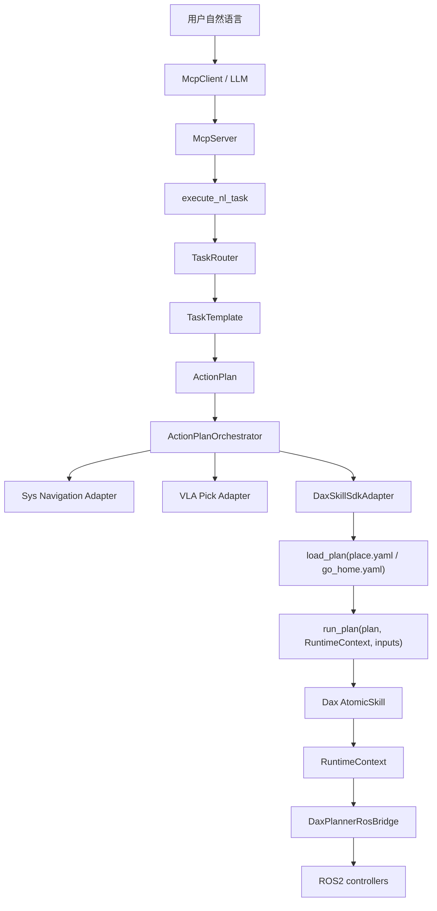

# Dax Planner SDK 接入 DimOS 方案

> 状态：技术方案草案  
> 目标读者：DimOS 技术评审成员、Dax SDK 提供方、后续实现人员。  
> 相关项目：`/home/miaoli/Projects/dax_planner_ws-main`、`/home/miaoli/Projects/dimos`
> Dax 技能事实源：`/home/miaoli/Projects/dax_planner_ws-main/README.md`

---

AtomicSkill 我有点模糊 

上半身的最小执行单元是一个pick动作  

执行单元-约束条件-触发条件
1.左右手决策  agent os去判断
2.抓取是否成功 success or not  /action
信息辅助判断

颜色/形状 区分   -   place
place
约束条件-触发条件
不知道物体存在不能有place   决策-agent os


下半生的最小执行单元是指点导航
104-服务器下发路径

## 1. 结论

`dax_planner_ws-main` 不是一个简单的函数库，而是一套面向 DaxBot 的 ROS2 Python workspace。它的核心能力是：

```text
YAML composite skill
  -> Plan AST
  -> SkillExecutor
  -> AtomicSkill
  -> RuntimeContext
  -> daxplanner primitive
  -> DaxPlannerRosBridge
  -> ROS2 controllers
```

接入 DimOS 时，推荐把 Dax SDK 放在 **Adapter 层**，不要把它的每个 atomic skill 暴露成 MCP tool。

推荐链路：

```text
DimOS execute_nl_task
  -> TaskRouter
  -> TaskTemplate
  -> ActionPlan
  -> ActionPlanOrchestrator
  -> DaxSkillSdkAdapter
  -> dax_skill_sdk.run_plan(...)
  -> RuntimeContext
  -> DaxPlannerRosBridge
  -> ROS2 controllers
```

第一版建议优先接：

- `place.yaml`
- `go_home.yaml`
- fetch/drop 中的 `vla_drop_sku` 后端

pick 暂时保留当前 VLA / py_rosbridge 路线，等 SDK 同事提供稳定 pick/grasp contract 后再迁移。

技能映射维护时，`/home/miaoli/Projects/dax_planner_ws-main/README.md` 是 Dax 侧事实源。DimOS 文档、adapter 和测试可以解释如何接入，但不能凭 DimOS 侧假设新增 Dax skill 名、YAML inputs、group 名或 CLI 行为；这些必须回到 Dax README 和 `dax_skill_sdk/composite_skill/*.yaml` 校验。

---

## 2. dax_planner_ws-main 项目结构

当前 workspace 位置：

```text
/home/miaoli/Projects/dax_planner_ws-main
```

主要包含两个 ROS2 Python 包：

```text
src/
  dax_skill_sdk/
  dax_planner_executor/
```

### 2.1 `dax_skill_sdk`

这是 Dax 侧的 YAML 技能编排 SDK。

关键文件：

| 文件 | 作用 |
|------|------|
| `dax_skill_sdk/runtime.py` | 创建并持有 `RuntimeContext`，管理 ROS bridge、daxplanner primitive、blackboard |
| `dax_skill_sdk/registry.py` | atomic skill 注册表，`name -> AtomicSkill class` |
| `dax_skill_sdk/result.py` | Dax SDK 内部 `SkillResult` |
| `dax_skill_sdk/executor/yaml_loader.py` | 将 YAML 解析成 `Plan` |
| `dax_skill_sdk/executor/plan.py` | `TaskNode`、`IfNode`、`RepeatNode`、`FailNode` 等 AST 节点 |
| `dax_skill_sdk/executor/skill_executor.py` | `run_plan(plan, ctx, inputs)` 执行入口 |
| `dax_skill_sdk/atomic_skill/*` | `joint_move`、`cartesian_move`、`hand_move` 等原子动作 |
| `dax_skill_sdk/composite_skill/*.yaml` | composite skill，例如 `place.yaml`、`go_home.yaml` |

### 2.2 `dax_planner_executor`

这是 daxplanner primitive 和 ROS2 controller 的桥。

关键文件：

| 文件 | 作用 |
|------|------|
| `dax_planner_executor/ros_bridge.py` | `DaxPlannerRosBridge`，订阅 `/joint_states` 并下发 FollowJointTrajectory |
| `dax_planner_executor/plan_and_run.py` | demo/调试入口，读取关节状态、规划并下发 |

`plan_and_run.py` 更像 demo；真正适合 DimOS 接入的是 `dax_skill_sdk` 的可编程路径：

```text
load_plan(yaml_path)
RuntimeContext.setup()
run_plan(plan, ctx, inputs)
```

---

## 3. Dax SDK 的执行链路

### 3.1 YAML composite skill

例如 `place.yaml`：

```yaml
schema_version: 2
name: place_90
inputs:
  arm_name:
    type: str
    required: true
  grasp_type:
    type: str
    required: true
  target_name:
    type: str
    required: true
steps:
  - if:
      when:
        expr: "inputs.arm_name == 'right'"
      then:
        - skill: hand_move
          name: pre_open_left_hand
          params:
            side: left
            positions: [25, 60, 30, 30, 30, 30]
```

YAML 支持：

- `inputs`
- `save_as`
- `ref`
- `expr`
- `if / elif / else`
- `repeat`
- `continue_on_failure`
- `fail`

根据 Dax README，composite skill 的输入声明支持：

- 类型：`str`、`int`、`float`、`bool`、`list`、`dict`
- 属性：`required`、`default`
- Executor 会按 YAML inputs 做类型转换、检查必填项、补默认值，并拒绝未声明输入。

因此 DimOS 的任务级技能映射不能把自然语言 slot 直接自由塞给 Dax；必须先映射到 YAML 声明过的 inputs。

### 3.2 Plan AST

`yaml_loader.py` 不会直接执行 YAML，而是先转成 AST：

```text
Plan
  -> TaskNode
  -> IfNode
  -> RepeatNode
  -> FailNode
```

这个设计对 DimOS 很友好，因为它天然就是“结构化计划”，和 DimOS 的 `ActionPlan` 思路一致。

### 3.3 AtomicSkill

Dax atomic skill 的基类是：

```python
class AtomicSkill(ABC):
    name: str = ""

    @abstractmethod
    def execute(self, params: Dict[str, Any], ctx: RuntimeContext) -> SkillResult:
        ...

    @classmethod
    def validate(cls, params: Dict[str, Any]) -> Optional[str]:
        return None
```

当前已看到的 atomic skill 包括：

- `joint_move`
- `cartesian_move`
- `cartesian_line`
- `cartesian_delta_move`
- `joint_set`
- `head_move`
- `hand_move`
- `wait`

这份列表以 Dax README 为准。DimOS 可以把这些能力作为 SDK 内部事实记录，但不能把它们升级成 MCP tool，也不能让 LLM 直接填写关节角、TCP、手指位置或轨迹参数。

这些是机器人动作 DSL，不是 Agent tool。

### 3.4 RuntimeContext

`RuntimeContext.setup()` 会做比较重的初始化：

```text
append daxplanner SDK paths
  -> import rf_collision_world / rf_robot_model
  -> create DualBaseX7Primitive
  -> rclpy.init
  -> create DaxPlannerRosBridge
  -> create MultiThreadedExecutor
  -> spin in background thread
  -> wait for /joint_states
```

因此它不适合在每次 LLM tool call 里临时创建。DimOS 接入时应让 adapter 或 Module 长生命周期持有它。

### 3.5 DaxPlannerRosBridge

`DaxPlannerRosBridge` 做两类事：

- 订阅 `/joint_states`，提供当前机器人状态。
- 将 daxplanner 返回的 `waypoints + groups` 下发到 ROS2 controller。

它当前支持的 controller/action 包括：

- `/left_arm_controller/follow_joint_trajectory`
- `/right_arm_controller/follow_joint_trajectory`
- `/waist_controller/follow_joint_trajectory`
- `/waist_rotation_controller/follow_joint_trajectory`
- `/head_controller/follow_joint_trajectory`

灵巧手通过 topic 下发：

```text
cb_left_hand_control_cmd
cb_right_hand_control_cmd
```

---

## 4. DimOS Skill 与 Dax Skill 的边界

这里最容易混淆。

### 4.1 DimOS `@skill`

DimOS 的 `@skill` 是 MCP tool 暴露机制：

```text
@skill method
  -> becomes RPC
  -> Module.get_skills()
  -> McpServer tools/list
  -> LLM can call it
```

它的使用原则：

- 少而稳定。
- 参数 schema 要简单。
- docstring 要给 LLM 看得懂。
- 不直接暴露低层控制能力。

当前 VLA Pick 的正确方向是统一入口：

```text
execute_nl_task(text: str, request_id: str = "")
```

### 4.2 Dax `AtomicSkill` / YAML skill

Dax 的 skill 是动作 DSL：

```text
YAML skill: joint_move
YAML skill: cartesian_move
YAML skill: hand_move
```

它们应该由 Dax executor 执行，不应该被 LLM 直接调用。

### 4.3 边界原则

不推荐：

```text
LLM -> joint_move
LLM -> cartesian_move
LLM -> hand_move
LLM -> 拼 YAML
```

推荐：

```text
LLM
  -> execute_nl_task
  -> DimOS ActionPlan
  -> DaxSkillSdkAdapter
  -> Dax composite YAML
  -> Dax AtomicSkill
```

也就是说：Dax atomic skill 是机器人底层能力，不是 MCP tool。

---

## 5. 推荐接入架构



### 5.1 第一版接入点

优先接 drop/place：

```text
fetch_sku ActionPlan
  step-1: move_to_workspace(source)
  step-2: vla_pick_sku
  step-3: move_to_workspace(target)
  step-4: vla_drop_sku
```

其中 `vla_drop_sku` 当前可以接到 Dax SDK：

```text
vla_drop_sku
  -> DaxSkillSdkAdapter.place(...)
  -> place.yaml
```

### 5.2 暂不迁移 pick

pick 当前已有 VLA / py_rosbridge 路线。除非 SDK 同事提供稳定 pick/grasp composite skill 或 planner API，否则第一版不迁移 pick。

这样风险更小：

- pick 当前链路不被打断。
- drop/place 能先用 Dax SDK 验证。
- SDK contract 可以逐步稳定。

---

## 6. DaxSkillSdkAdapter 设计

建议在 DimOS 里新增内部 adapter，而不是新增 MCP tool。

### 6.1 职责

`DaxSkillSdkAdapter` 负责：

- 管理 `RuntimeContext` 生命周期。
- 查找 composite skill YAML。
- 加载并校验 YAML。
- 将 DimOS 输入转换为 Dax `inputs`。
- 调用 `run_plan(plan, ctx, inputs)`。
- 将 Dax `SkillResult` 列表转换为 DimOS `SkillResult` metadata。

### 6.2 建议接口

```python
class DaxSkillSdkAdapter:
    def setup(self) -> None: ...
    def shutdown(self) -> None: ...

    def run_composite_skill(
        self,
        *,
        yaml_name: str,
        inputs: dict[str, Any],
        request_id: str,
    ) -> SkillResult[Any]: ...

    def go_home(self, *, request_id: str) -> SkillResult[Any]: ...

    def place(
        self,
        *,
        arm_name: str,
        grasp_type: str,
        target_name: str,
        request_id: str,
    ) -> SkillResult[Any]: ...
```

### 6.3 运行时策略

推荐：

- adapter 初始化时不一定马上 `setup()`。
- 第一次执行前 lazy setup。
- setup 成功后复用同一个 `RuntimeContext`。
- shutdown 由 Module stop 或进程退出时处理。

不推荐：

- 每个 task 都新建 `RuntimeContext`。
- 每个 step 都重新 `rclpy.init()`。
- 在 `@skill` 方法里直接写 SDK 初始化细节。

### 6.4 结果转换

Dax SDK 内部 result：

```python
SkillResult(success: bool, message: str, data: dict)
```

DimOS adapter 输出建议：

```json
{
  "request_id": "req-...",
  "sdk": "dax_skill_sdk",
  "composite_skill": "place.yaml",
  "inputs": {
    "arm_name": "left",
    "grasp_type": "Default",
    "target_name": "cube"
  },
  "results": [
    {
      "success": true,
      "message": "joint_move body_dual 完成",
      "data": {}
    }
  ],
  "failed_step": null,
  "phase": "vla_drop_sku"
}
```

---

## 7. 与 VLA Pick / Fetch / Drop 的关系

### 7.1 当前 VLA Pick 链路

当前 DimOS VLA Pick 主链路是：

```text
execute_nl_task
  -> TaskRouter
  -> PickSkuTemplate / FetchSkuTemplate
  -> ActionPlanOrchestrator
  -> /go_to_workspace
  -> /pick_sku
  -> validate_vla_pick_payload
  -> /execute_pick_task
```

这个方向保留。

### 7.2 Dax SDK 接 drop/place

fetch 的后半段可以演进为：

```text
move_to_workspace(target)
  -> vla_drop_sku
  -> DaxSkillSdkAdapter.place
  -> place.yaml
  -> Dax atomic skill
  -> ROS2 controllers
```

### 7.3 inputs 映射

`place.yaml` 当前要求：

```text
arm_name
grasp_type
target_name
```

DimOS 侧需要明确映射来源：

| Dax input | 建议来源 |
|-----------|----------|
| `arm_name` | VLA pick metadata、策略默认值或配置 |
| `grasp_type` | SKU metadata，缺省可用 `Default` |
| `target_name` | SKU catalog id；如果没有 catalog，临时用 `sku_name` |

如果 SDK 同事要求 `target_name` 必须是正式商品编码，例如 `FODX000000015`，则 DimOS 需要新增 SKU catalog mapping，不能直接把自然语言里的 `cube` 传进去。

---

## 8. 配置项建议

建议新增或约定以下配置：

```bash
DAX_SKILL_SDK_ENABLED=true
DAX_SKILL_SDK_WS=/home/miaoli/Projects/dax_planner_ws-main
DAX_SKILL_COMPOSITE_DIR=/home/miaoli/Projects/dax_planner_ws-main/src/dax_skill_sdk/dax_skill_sdk/composite_skill
DAX_SKILL_RUNTIME_CONFIG=DaxBot_X7Pro.yaml
DAX_SKILL_STEP_CONFIRM=false
DAX_SKILL_DRY_RUN=false
DAX_SKILL_TIMEOUT_S=60
```

配置含义：

| 配置 | 作用 |
|------|------|
| `DAX_SKILL_SDK_ENABLED` | 是否启用 Dax SDK adapter |
| `DAX_SKILL_SDK_WS` | Dax workspace 路径 |
| `DAX_SKILL_COMPOSITE_DIR` | composite YAML 目录 |
| `DAX_SKILL_RUNTIME_CONFIG` | daxplanner primitive 配置 |
| `DAX_SKILL_STEP_CONFIRM` | 真机调试时是否每步确认 |
| `DAX_SKILL_DRY_RUN` | 是否只加载/校验不下发 |
| `DAX_SKILL_TIMEOUT_S` | 单次 composite skill 超时 |

---

## 9. 错误码与 metadata

建议 DimOS adapter 不直接暴露 Dax SDK 自由文本错误，而是映射成稳定错误码。

| 错误码 | 场景 |
|--------|------|
| `DAX_SDK_DISABLED` | 配置禁用 |
| `DAX_SDK_UNAVAILABLE` | Dax SDK import 失败或路径不存在 |
| `DAX_RUNTIME_NOT_READY` | `RuntimeContext.setup()` 失败，例如没有 `/joint_states` |
| `DAX_PLAN_LOAD_FAILED` | YAML 不存在或 schema 错误 |
| `DAX_INPUT_INVALID` | 缺少 `arm_name`、`grasp_type`、`target_name` 等输入 |
| `DAX_SKILL_FAILED` | 某个 atomic skill 返回失败 |
| `DAX_EXECUTION_TIMEOUT` | composite skill 执行超时 |

metadata 至少包含：

```text
request_id
sdk
composite_skill
inputs
results
failed_step
phase
duration_ms
```

如果是 fetch/drop，metadata 还应保留：

```text
intent
route
action_plan
navigation_results
vla_results
dax_results
```

---

## 10. 测试计划

### 10.1 Dax workspace 自测

在 `/home/miaoli/Projects/dax_planner_ws-main` 中运行 SDK 自测：

```bash
pytest src/dax_skill_sdk/test -q
```

目标：

- YAML loader 正常。
- value resolver 正常。
- atomic skill validate 正常。
- skill executor 控制流正常。

### 10.2 DimOS adapter 单元测试

用 mock 代替真实 `RuntimeContext` 和 `run_plan`：

- YAML 不存在 -> `DAX_PLAN_LOAD_FAILED`
- Runtime setup 失败 -> `DAX_RUNTIME_NOT_READY`
- Dax step 失败 -> `DAX_SKILL_FAILED`
- 全部成功 -> DimOS `SkillResult.ok`
- metadata 包含 `composite_skill`、`inputs`、`results`

### 10.3 Orchestrator 集成测试

围绕 fetch/drop：

- `vla_drop_sku` 调到 `DaxSkillSdkAdapter.place`
- 导航失败时不调用 Dax adapter
- pick 失败时不调用 Dax adapter
- Dax drop 失败时整体 fetch 失败
- Dax 成功时 metadata 保留 `phase`

### 10.4 MCP 暴露检查

运行：

```bash
dimos mcp list-tools
```

期望：

- 仍只暴露统一任务入口，例如 `execute_nl_task`。
- 不出现 Dax atomic skill，例如 `joint_move`、`cartesian_move`、`hand_move`。

---

## 11. codegraph 索引计划

当前发现：

```text
/home/miaoli/Projects/dax_planner_ws-main
```

还没有 `.codegraph` 索引。后续真正实施 SDK 接入前，建议先在该 workspace 建索引。

索引后优先用 codegraph 梳理：

```text
RuntimeContext
run_plan
load_plan
AtomicSkill
SkillResult
DaxPlannerRosBridge
CartesianMoveSkill
JointMoveSkill
HandMoveSkill
```

目标是确认：

- Runtime 生命周期是否能被 DimOS 长生命周期持有。
- `run_plan` 是否线程安全。
- `RuntimeContext.blackboard` 是否会在并发任务中互相污染。
- Dax SDK 是否支持 dry-run。
- composite YAML 是否能稳定传入外部 inputs。

---

## 12. SDK 同事对齐问题

### 12.1 composite skill contract

- 第一批稳定支持哪些 YAML？
- `place.yaml` 是否就是正式 drop/place contract？
- `go_home.yaml` 是否允许 DimOS 在 recovery 时调用？
- 是否会提供 pick/grasp YAML？

### 12.2 inputs contract

- `arm_name` 允许值是 `left/right` 还是更多？
- `grasp_type` 的枚举是什么？
- `target_name` 是否必须是正式商品编码？
- 如果自然语言里只有 `cube`，SDK 是否接受？
- `target_name` 和 SKU catalog 的映射由谁维护？

### 12.3 runtime contract

- `RuntimeContext` 是否允许长期持有？
- 是否允许多个任务并发调用？
- 如果不允许并发，SDK 是否提供 busy 状态？
- 执行中如何 cancel？
- controller 失败时是否能返回明确失败 step？

### 12.4 安全 contract

- Dax planner 是否做碰撞检测？
- Bullet 预演是否是强制安全门，还是调试工具？
- 真机下发前是否能 dry-run validate？
- 机械臂执行中遇到动态障碍如何处理？
- 灵巧手 topic 没有 action feedback，如何判断成功？

---

## 13. 实施路线图

### Phase 0：文档和索引

- 写入本接入方案。
- 为 `dax_planner_ws-main` 建 codegraph 索引。
- 用 codegraph 精读 Runtime、Executor、Bridge 调用关系。

### Phase 1：Adapter MVP

- 新增 `DaxSkillSdkAdapter`。
- 支持 `go_home.yaml` 和 `place.yaml`。
- 支持 mock runtime 单元测试。
- 不接 MCP tool。

### Phase 2：接入 fetch/drop

- 将 `vla_drop_sku` 后端接到 Dax adapter。
- 保持 pick 当前 VLA / py_rosbridge 路线。
- 增加失败早返回和 metadata。

### Phase 3：真机联调

- 在真实 ROS2 controller 环境验证 `/joint_states`。
- 验证 `place.yaml` 的 inputs。
- 验证失败时 metadata 可追踪。
- 验证 `go_home.yaml` recovery。

### Phase 4：扩展 pick/grasp

- 等 SDK 同事提供稳定 pick/grasp contract。
- 决定 pick 是否从 VLA / py_rosbridge 迁移到 Dax SDK。
- 如果迁移，仍通过 `ActionPlanOrchestrator`，不新增 pick 专用 MCP tool。
