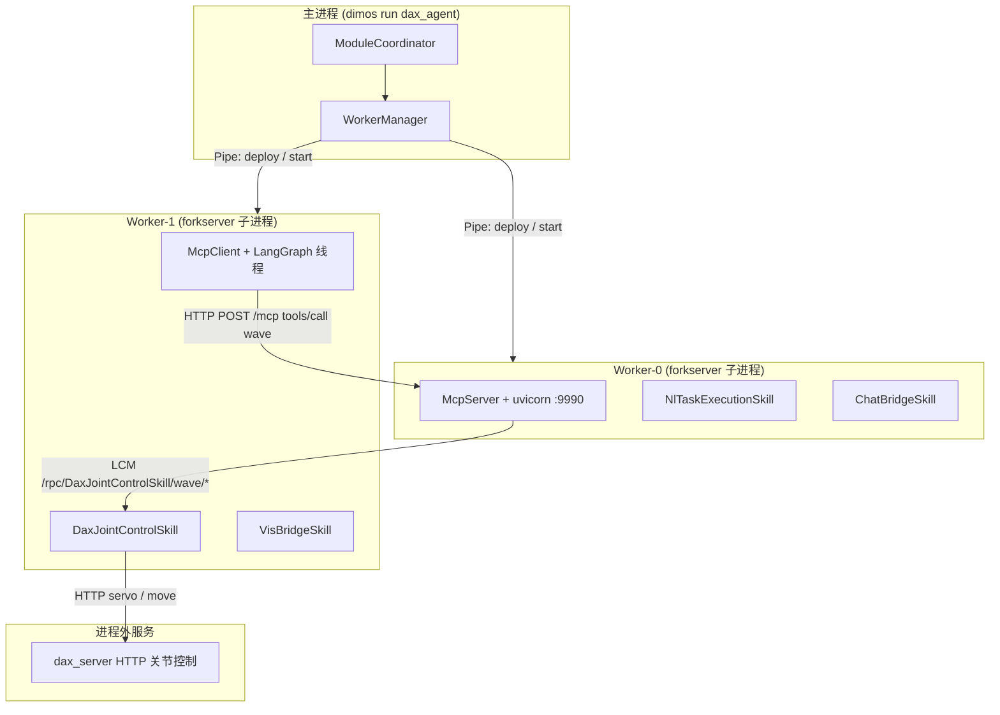

# Blueprint 一次调用路径（以 `dax_agent` + `wave` 为例）

> 讲代码 / 调试跨进程 RPC 时的参考文档。  
> 示例 blueprint：`dax_agent`；示例 skill：`DaxJointControlSkill.wave`。

---

## 1. 先纠正一个常见误解

**`McpClient` 上没有 `wave()` 方法。**

| 概念 | 实际位置 |
|------|----------|
| `@skill def wave(...)` | `DaxJointControlSkill`（worker 进程内） |
| LangGraph 工具名 `wave` | `McpClient` 从 MCP `tools/list` 动态注册 |
| HTTP 入口 `tools/call name=wave` | `McpServer`（worker 进程内的 uvicorn） |

Agent 或 CLI 调用的是 **MCP 工具 `wave`**，McpServer 再经 **LCM RPC** 转发到 `DaxJointControlSkill.wave`。

---

## 2. 三层通信模型

一次 skill 调用会穿过三种不同的通信层：

| 层 | 机制 | 典型用途 |
|----|------|----------|
| **主进程 ↔ Worker** | `multiprocessing.Pipe` + `CallMethodRequest` | 部署模块、`build()`、`start()`、`stop()` |
| **Worker ↔ Worker** | LCM 组播 + Pickle（`/rpc/...`） | 所有 `@rpc` / `@skill` 跨模块调用 |
| **McpClient ↔ McpServer** | HTTP JSON-RPC（`POST /mcp`） | MCP 协议：`tools/list`、`tools/call` |

**记忆口诀：** Worker = OS 进程隔离；LCM RPC = 进程间方法调用；HTTP = MCP 对外入口。

---

## 3. Blueprint 与进程布局

### 3.1 `dax_agent` 组成

[`dimos/agents/dax_agent.py`](../../dimos/agents/dax_agent.py)：

```python
dax_agent = autoconnect(
    NlTaskExecutionSkill.blueprint(),
    DaxJointControlSkill.blueprint(),
    ChatBridgeSkill.blueprint(),
    VisBridgeSkill.blueprint(),
    McpServer.blueprint(),
    McpClient.blueprint(model=..., system_prompt=...),
).global_config(
    mcp_tool_allowlist="execute_nl_task,wave,head_accept,head_reject",
)
```

6 个 Module，默认 `GlobalConfig.n_workers=2`，由 [`WorkerManager`](../../dimos/core/coordination/worker_manager_python.py) 负载均衡分配到 **forkserver 子进程**（除非 Module 声明 `dedicated_worker = True`）。

### 3.2 进程图（典型布局）

实际 Worker 分配因负载而异，下面是一种常见情况：



### 3.3 Worker 进程如何创建 Module

[`PythonWorker`](../../dimos/core/coordination/python_worker.py) 使用 **forkserver**（避免 `fork` 后 CUDA 上下文损坏）：

1. 主进程 `Pipe()` 连接子进程
2. 发送 `DeployModuleRequest(module_class, kwargs)` → 子进程 `module_class(**kwargs)`
3. 父进程得到 `Actor` 代理；后续 `start()` 等经 Pipe 转发

子进程事件循环见 `_worker_entrypoint` / `_handle_request`。

---

## 4. 启动阶段：skill 如何挂到 McpServer

### 4.1 顺序

[`ModuleCoordinator.start_all_modules`](../../dimos/core/coordination/module_coordinator.py)：

1. 对所有已部署 Module 并行 `start()`
2. `_send_on_system_modules()` — 每个 Module 的 `on_system_modules(modules)` 被调用

### 4.2 McpServer 注册 `rpc_calls`

[`McpServer.on_system_modules`](../../dimos/agents/mcp/mcp_server.py)（在 **McpServer 所在 worker** 内执行）：

1. 对每个 `RPCClient` 代理 RPC 调用 `get_skills()`  
   - LCM：`/rpc/DaxJointControlSkill/get_skills/req` → `/res`
2. 按 `mcp_tool_allowlist` 过滤
3. 构建 `app.state.rpc_calls["wave"] = RpcCall(..., remote_name="DaxJointControlSkill")`

### 4.3 McpClient 拉取 MCP 工具

[`McpClient.on_system_modules`](../../dimos/agents/mcp/mcp_client.py)：

1. HTTP `initialize` + `tools/list`
2. 每个 tool 包装为 LangGraph `StructuredTool`；`call_tool` → `_mcp_tool_call(name, kwargs)`

### 4.4 Module 如何订阅 RPC topic

每个 Module 在 `__init__` 中（[`Module.__init__`](../../dimos/core/module.py)）：

```python
self.rpc = self.config.rpc_transport(...)
self.rpc.serve_module_rpc(self)  # 订阅 /rpc/{ClassName}/{method}/req
self.rpc.start()
```

[`serve_module_rpc`](../../dimos/protocol/rpc/spec.py) 为每个 `@rpc` 方法（含 `@skill`）注册 handler，topic 名为 `{ClassName}/{method_name}`，例如 `DaxJointControlSkill/wave`。

---

## 5. 一次 `wave` 的逐步调用链

### Step 0：用户输入

用户说「挥挥手」→ LCM topic **`/human_input`** → `McpClient.human_input` 流 → agent 线程 `HumanMessage`。

### Step 1：LLM 选择工具

`McpClient._thread_loop` 内 LangGraph 运行；模型输出 `tool_calls: [{name: "wave", ...}]`。

相关 LCM（可选观测）：

- **`/agent_reasoning`** — thought / action / observation 步骤
- **`/agent`** — 完整 LangChain 消息

### Step 2：McpClient → HTTP MCP

[`_mcp_tool_call`](../../dimos/agents/mcp/mcp_client.py)：

```
POST http://<listen_host>:<mcp_port>/mcp   # 默认 :9990
JSON-RPC: method=tools/call
params: { name: "wave", arguments: {...}, _meta: { progressToken: "<uuid>" } }
```

### Step 3：McpServer 处理 `tools/call`

[`_handle_tools_call`](../../dimos/agents/mcp/mcp_server.py)：

1. allowlist 检查（`wave` 须在 `mcp_tool_allowlist` 内）
2. `rpc_call = rpc_calls["wave"]`
3. capability 占用（`wave` 默认无 `uses`，跳过）
4. `run_in_executor(None, lambda: rpc_call(**call_kwargs))` — 避免阻塞 uvicorn 事件循环

### Step 4：RpcCall → LCM RPC

[`RpcCall.__call__`](../../dimos/core/rpc_client.py) → [`call_sync("DaxJointControlSkill/wave", ...)`](../../dimos/protocol/rpc/spec.py)

| Topic | 方向 | Payload 要点 |
|-------|------|--------------|
| **`/rpc/DaxJointControlSkill/wave/req`** | 发布请求 | `{ id, name, args: ([positional], {kwargs}) }` |
| **`/rpc/DaxJointControlSkill/wave/res`** | 订阅响应 | `{ id, res: "<返回字符串>" }` 或 `{ id, exception: ... }` |

Topic 命名（[`LCMRPC.topicgen`](../../dimos/protocol/rpc/pubsubrpc.py)）：

```
/rpc/{ClassName}/{method}/{req|res}
# 过长时 ClassName 段会 hash 为 short_id
```

**DaxJointControlSkill worker** 内 LCM 收到 req → `ThreadPoolExecutor` 执行 handler → publish res（[`serve_rpc`](../../dimos/protocol/rpc/pubsubrpc.py)）。

### Step 5：业务逻辑 + 外部 HTTP

[`DaxJointControlSkill.wave`](../../dimos/agents/skills/dax_joint_control_skill.py)：

1. 加载挥手 keyframe JSON（`GlobalConfig.dax_wave_animation_path`）
2. [`DaxJointRequestClient`](../../dimos/agents/skills/dax_joint_request_client.py) HTTP 调 **`dax_server`**（`move_dual_joints` / `servo_dual_joints`）
3. 返回中文字符串，例如 `"你好！我跟你挥了挥手"`

此步 **不再走 LCM**，是 Module 内部的 HTTP 客户端。

### Step 6：返回值原路返回

```
wave() 返回 str
  → LCM /rpc/DaxJointControlSkill/wave/res
  → RpcCall.call_sync 解除阻塞（McpServer worker）
  → HTTP JSON-RPC result { content: [{ type: "text", text: "..." }] }
  → McpClient LangGraph ToolMessage
  → /agent、/agent_reasoning（VisBridge 等可选订阅）
```

---

## 6. CLI 直连路径（跳过 LangGraph）

```bash
dimos mcp call wave
# 等价于 POST :9990/mcp  tools/call name=wave
```

从 Step 3 开始与 Agent 路径相同，不经过 `McpClient` 的 LLM。

---

## 7. LCM / HTTP Topic 速查

### 7.1 本示例 RPC

| Topic / URL | 作用 |
|-------------|------|
| `/rpc/DaxJointControlSkill/wave/req` | wave 请求 |
| `/rpc/DaxJointControlSkill/wave/res` | wave 响应 |
| `/rpc/DaxJointControlSkill/get_skills/req` | 启动时收集 skill 元数据 |
| `/rpc/McpServer/on_system_modules/req` | 启动回调 |
| `/rpc/McpClient/on_system_modules/req` | McpClient 初始化 tools |

### 7.2 Agent 与 MCP 辅助流

| Topic | 作用 |
|-------|------|
| `/human_input` | 用户文本 → Agent |
| `/agent` | Agent 消息（Human/AI/Tool） |
| `/agent_reasoning` | 推理步骤（thought/action/observation） |
| `/tool_streams` | MCP tool 进度（[`tool_stream.py`](../../dimos/agents/mcp/tool_stream.py)；instant skill 通常无长流） |
| `POST http://localhost:9990/mcp` | MCP JSON-RPC（`GlobalConfig.mcp_port`） |

### 7.3 Pipe 消息（主进程 ↔ Worker，非 LCM）

| 消息类型 | 作用 |
|----------|------|
| `DeployModuleRequest` | 在 worker 内实例化 Module |
| `CallMethodRequest` | 调用 `build` / `start` / `stop` 等 @rpc |
| `GetAttrRequest` | 读 worker 内属性（如 stream 对象） |

定义见 [`worker_messages.py`](../../dimos/core/coordination/worker_messages.py)。

---

## 8. DimOS Worker vs Python「worker」

讲架构时务必区分 **两种不同含义**：

### 8.1 DimOS `PythonWorker` = 独立 OS 进程

- forkserver 子进程，可托管 **多个 Module**（除非 `dedicated_worker=True`）
- 主进程通过 **Pipe** 控制生命周期，**不直接**调用 Module 方法
- 目的：进程隔离、GIL 分摊、崩溃 containment、CUDA-safe spawn

### 8.2 Python 标准库里的 worker = 同进程并发

DimOS **在 worker 进程内部** 仍使用这些机制：

| 机制 | 位置 | 作用 |
|------|------|------|
| `ThreadPoolExecutor` | [`PubSubRPCMixin`](../../dimos/protocol/rpc/pubsubrpc.py) | LCM RPC handler 在线程池执行，避免嵌套 RPC 死锁 |
| `threading.Thread` | `McpClient._thread_loop` | LangGraph agent 循环 |
| `asyncio` + uvicorn | `McpServer` | HTTP MCP 服务 |
| `run_in_executor` | `_handle_tools_call` | 同步 RPC 不阻塞 asyncio 事件循环 |

| 对比项 | DimOS PythonWorker | Thread / asyncio worker |
|--------|-------------------|-------------------------|
| 隔离 | 进程（独立 PID） | 同进程共享内存 |
| 通信 | Pipe + LCM | 队列、回调、共享对象 |
| 典型用途 | 跑 Module 子系统 | RPC 执行、HTTP、LLM 循环 |
| 崩溃影响 | 通常仅该 worker 内模块 | 可能拖垮整个进程 |

---

## 9. 调试清单

按调用顺序观测：

```bash
# 1. 确认 blueprint 在跑
dimos status

# 2. 直连 MCP（绕过 LLM）
dimos mcp call wave

# 3. 监听 wave RPC topic
dimos lcmspy /rpc/DaxJointControlSkill/wave/req
dimos lcmspy /rpc/DaxJointControlSkill/wave/res

# 4. 看 Agent 推理
dimos lcmspy /agent_reasoning

# 5. 结构化日志
dimos log -f
```

在代码里打断点 / 加 log 的推荐位置：

| 阶段 | 文件 | 符号 |
|------|------|------|
| HTTP 入口 | `mcp_server.py` | `_handle_tools_call` |
| LCM 发出 | `rpc_client.py` | `RpcCall.__call__` |
| LCM 接收 | `pubsubrpc.py` | `serve_rpc` → `execute_and_respond` |
| 业务 | `dax_joint_control_skill.py` | `wave`, `_run_wave_sequence` |
| Agent 选 tool | `mcp_client.py` | `_mcp_tool_call`, `_process_message` |

---

## 10. 关键源文件索引

| 主题 | 路径 |
|------|------|
| Blueprint 定义 | [`dimos/agents/dax_agent.py`](../../dimos/agents/dax_agent.py) |
| wave skill | [`dimos/agents/skills/dax_joint_control_skill.py`](../../dimos/agents/skills/dax_joint_control_skill.py) |
| MCP Server | [`dimos/agents/mcp/mcp_server.py`](../../dimos/agents/mcp/mcp_server.py) |
| MCP Client | [`dimos/agents/mcp/mcp_client.py`](../../dimos/agents/mcp/mcp_client.py) |
| RpcCall 代理 | [`dimos/core/rpc_client.py`](../../dimos/core/rpc_client.py) |
| LCM RPC 实现 | [`dimos/protocol/rpc/pubsubrpc.py`](../../dimos/protocol/rpc/pubsubrpc.py) |
| RPC topic 注册 | [`dimos/protocol/rpc/spec.py`](../../dimos/protocol/rpc/spec.py) |
| Module 基类 | [`dimos/core/module.py`](../../dimos/core/module.py) |
| Worker 进程 | [`dimos/core/coordination/python_worker.py`](../../dimos/core/coordination/python_worker.py) |
| 部署编排 | [`dimos/core/coordination/module_coordinator.py`](../../dimos/core/coordination/module_coordinator.py) |
| Agent 能力总览 | [`docs/capabilities/agents/readme.md`](../capabilities/agents/readme.md) |
| Blueprint 用法 | [`docs/usage/blueprints.md`](../usage/blueprints.md) |
| LCM 用法 | [`docs/usage/lcm.md`](../usage/lcm.md) |

---

## 11. 泛化到其他 blueprint

任意 agentic blueprint（如 `unitree-go2-agentic`）路径相同，仅 **Module 类名** 和 **skill 名** 不同：

1. `@skill` 方法在各自 Module worker 内执行
2. McpServer `on_system_modules` 统一注册 `rpc_calls`
3. LCM topic 一律 `/rpc/{ModuleClass}/{method}/{req|res}`
4. 若 skill 需长时间运行且声明 `lifecycle="background"`，capabilities 与 `/tool_streams` 生命周期见 [`docs/usage/tool_streams.md`](../usage/tool_streams.md)

替换示例：`UnitreeSkillContainer/move` → `/rpc/UnitreeSkillContainer/move/req`。
