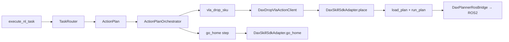

# dax_skill_sdk YAML 上半身控制路径

DimOS 上半身有 **两条独立链路**，不要混用：

| 链路 | 技术栈 | 配置 | MCP 入口 |
|------|--------|------|----------|
| **A. dax_skill_sdk（本文）** | YAML → `run_plan` → ROS2 控制器 | `DAX_SKILL_*` | 无 atomic tool；经 `execute_nl_task` → fetch/drop 或 recovery `go_home` |
| **B. HTTP 关节服务** | JSON keyframe → `dax_server` | `DAX_JOINT_SERVER_URL` | `wave` / `head_*` |

`config/workspaces.yaml` 与 `config/nl_semantics.yaml` 管 **下半身导航与 NL 任务**，与 composite YAML **无关**。

---

## 调用路径（链路 A）



关键文件：

- 适配器：`dimos/agents/dax_skill_sdk_adapter.py`
- 工厂：`dimos/agents/vla_pick_adapter_factory.py` — `DAX_SKILL_ADAPTER=dax|dry_run|local`
- 动作目录：`dimos/agents/robot_action_catalog.py` — `vla_drop_sku` → `place.yaml`；`go_home` → `go_home.yaml`
- Orchestrator：`dimos/agents/task_action_plan.py` — `executor=dax` 执行 `go_home`；drop 仍走 VLA gateway + Dax wrapper
- Dax 事实源：`/home/miaoli/Projects/dax_planner_ws-main/README.md` 与 `composite_skill/*.yaml`

---

## 已映射 composite skill

| YAML | inputs | DimOS 入口 |
|------|--------|------------|
| `go_home.yaml` | 无 | NL `go_home` intent → `GoHomeTemplate` → `DaxSkillSdkAdapter.go_home` |
| `place.yaml` | `arm_name`, `grasp_type`, `target_name` | fetch/drop 链路的 `vla_drop_sku` |

LLM/MCP **不**暴露 `joint_move`、`cartesian_move` 等 atomic skill。

---

## 测试阶梯

### 阶段 0：环境与 build（真机前）

在机器人/仿真机上：

```bash
cd /home/miaoli/Projects/dax_planner_ws-main
source /opt/ros/humble/setup.bash
colcon build --packages-select dax_planner_executor dax_skill_sdk --symlink-install
source install/setup.bash
```

### 阶段 1：SDK 独立 dry-run

```bash
ros2 run dax_skill_sdk skill_executor .../go_home.yaml --dry-run
ros2 run dax_skill_sdk skill_executor .../place.yaml --dry-run \
  --input arm_name=right --input grasp_type=Default --input target_name=FODR0000000046
```

无 ROS 时可用 dimos venv + PYTHONPATH：

```bash
cd /home/miaoli/Projects/dimos && source .venv/bin/activate
PYTHONPATH=/home/miaoli/Projects/dax_planner_ws-main/src/dax_skill_sdk \
  python3 -m dax_skill_sdk.executor.skill_executor .../go_home.yaml --dry-run
```

### 阶段 2：DimOS adapter 单测

```bash
cd /home/miaoli/Projects/dimos
source .venv/bin/activate
pytest -o addopts= dimos/agents/test_dax_skill_sdk_adapter.py -v
pytest -o addopts= dimos/agents/test_task_action_plan.py -k go_home -v
```

### 阶段 3：DimOS dry-run 联调

`.env` 示例（见 `deploy/dax-agent.env.example`）：

```env
DAX_SKILL_ADAPTER=dry_run
DAX_SKILL_SDK_WS=/home/miaoli/Projects/dax_planner_ws-main
DAX_SKILL_COMPOSITE_DIR=.../composite_skill
DAX_SKILL_DRY_RUN=true
```

```bash
uv run python scripts/dax_skill_sdk_probe.py
```

### 阶段 4–5：真机

**136 / dax-agent 联调（推荐顺序）**

1. 启动 agent（YAML 真机需 ROS 环境）：

```bash
bash /opt/dax-agent/deploy/run_dax_agent_with_ros.sh
```

2. **subprocess dry-run** — 验证 `deploy/run_ros2_skill_executor.sh` + `go_home.yaml`（不 motion）：

```bash
bash /opt/dax-agent/deploy/run_ros2_skill_executor.sh \
  /home/nvidia/dax_planner_ws/src/dax_skill_sdk/dax_skill_sdk/composite_skill/go_home.yaml \
  --dry-run
```

3. **NL 回零** — 经 MCP `execute_nl_task`（agent 必须已在跑）：

```bash
cd /opt/dax-agent
dimos mcp call execute_nl_task --arg text="回零"
# 或
.venv/bin/python scripts/mcp_client.py call execute_nl_task --arg text="回零"
```

`.env` 真机示例（subprocess 模式，uv venv 不加载 dax_rf_planner）：

```env
DAX_SKILL_ADAPTER=dax
DAX_SKILL_DRY_RUN=false
DAX_SKILL_EXECUTOR=subprocess
DAX_SKILL_ROS_SETUP=/opt/ros/humble/setup.bash
DAX_SKILL_STEP_CONFIRM=false
```

通用真机脚本：

```bash
chmod +x scripts/dax_skill_sdk_robot_verify.sh
DAX_SKILL_DRY_RUN=false DAX_SKILL_STEP_CONFIRM=true ./scripts/dax_skill_sdk_robot_verify.sh
```

DimOS 真机 drop：

```env
DAX_SKILL_ADAPTER=dax
DAX_SKILL_DRY_RUN=false
```

```bash
dimos run dax-agent --daemon
dimos agent-send "把蓝色桌子的方块拿到绿色桌子"
dimos log -f   # composite_skill=place.yaml, sdk=dax_skill_sdk
```

Recovery 回零（经 NL，非 MCP atomic tool）：

```bash
dimos agent-send "回零"
```

---

## 配置对照

| 变量 | 作用 | 建议初值 |
|------|------|----------|
| `DAX_SKILL_ADAPTER` | `disabled` / `dry_run` / `dax` | 先 `dry_run` |
| `DAX_SKILL_DRY_RUN` | true=只 load/validate | 验证后 `false` |
| `DAX_SKILL_EXECUTOR` | `inprocess` / `subprocess` | dax-agent 真机用 `subprocess` |
| `DAX_SKILL_STEP_CONFIRM` | 每步回车 | 首次真机 `true`；MCP/后台用 `false` |
| `DAX_SKILL_TIMEOUT_S` | composite 超时 | 60–120 |

---

## 排查

| 现象 | 可能原因 |
|------|----------|
| `DAX_SDK_UNAVAILABLE` | workspace 未 build / path 不对；**dax-agent venv** 缺 dax_rf_planner → 设 `DAX_SKILL_EXECUTOR=subprocess` |
| `DAX_RUNTIME_NOT_READY` | 无 `/joint_states`、dax_rf_planner 缺失 |
| `DAX_PLAN_LOAD_FAILED` | YAML 路径或 `DAX_SKILL_COMPOSITE_DIR` 错误 |
| `DAX_INPUT_INVALID` | place 缺 inputs 或 resolver 未填 held_object |
| `UNSUPPORTED_PLAN` + DAX_SKILL_ADAPTER | `go_home` 需要 `DAX_SKILL_ADAPTER` ≠ disabled |

---

## 与 worker 进程模型

`DaxSkillSdkAdapter` 在 DimOS worker 内动态 import SDK；`RuntimeContext.setup()` 在本 worker 启动 ROS spin。真机联调时保证同一 ROS 域，避免重复 `rclpy.init` 冲突。详见 [worker-models.md](./worker-models.md).
