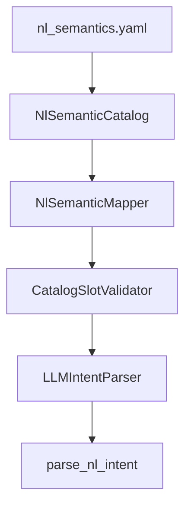

# NL 语义映射系统

> 单一事实源：[`config/nl_semantics.yaml`](../../config/nl_semantics.yaml)
>
> 所有语义匹配（方向、距离、颜色、工作区、SKU、pick 合法组合、loop 次数）只在 YAML 维护一次；代码不硬编码别名/关键词/合法组合。

## 架构



生产路径只有一条：`parse_nl_task_intent` → `LLMIntentParser` → `CatalogSlotValidator` → `TaskIntent`。

## YAML 段落说明

| 段 | 作用 |
|----|------|
| `intents` | 各 intent 的 `required_slots` / `llm_slots` / `description` |
| `movement_triggers` | 触发「这是导航指令」的动词/副词 |
| `object_task_exclusions` | 含这些词则 NOT 导航（pick/fetch 保护） |
| `directions` | 方向 → 别名 + confidence tiers |
| `distances.semantic_aliases` | 距离语义别名 → 数值（含中文数字 一/二/两/.../半） |
| `colors` | 颜色 → 别名 + nl |
| `workspaces` | 工作区 → aliases + requires_color |
| `pick.terms` | pick 触发词 |
| `pick.table_colors` | pick 合法 table 颜色集合 |
| `pick.trusted_combinations` | table_color → 允许的 sku_colors |
| `skus` | object_type → 别名（cube/方块/立方体, box/盒子, bottle/瓶子） |
| `fetch.keywords` / `fetch.alt_keywords` | fetch 触发词 |
| `guard.keywords` | guard/patrol 触发词 |
| `loop_counts.semantic_aliases` | loop 次数别名 |
| `canonical_templates` | outbound canonical NL（MCP/nav-mcp 对齐） |
| `eval_templates` | eval 数据集自动生成模板 |

## 如何扩展（只改 YAML）

### 新增方向口语变体

```yaml
directions:
  forward:
    aliases: [..., 向前走两步]   # 追加一行
```

### 新增工作区别名

```yaml
workspaces:
  front_workspace:
    aliases: [..., 开至前方]
```

### 新增 SKU 类型

```yaml
skus:
  cup:
    aliases: [cup, 杯子, 茶杯]
```

无需改 Python；mapper 的 `_normalize_sku_name` 自动从 `catalog.skus` 归一化。

### 新增 pick 合法颜色组合

```yaml
pick:
  table_colors: [blue, red, green, yellow]
  trusted_combinations:
    yellow: [red, blue, green]
```

`_validate_pick_sku_slots` 自动从 `catalog.pick.trusted_combinations` 校验。

### 新增距离语义别名

```yaml
distances:
  semantic_aliases:
    一小段: 0.2
```

## 代码入口

| 文件 | 作用 |
|------|------|
| [`navigation_semantic_catalog.py`](../../dimos/agents/nl/navigation_semantic_catalog.py) | `NlSemanticCatalog` 加载 + schema 校验 |
| [`navigation_semantic_mapper.py`](../../dimos/agents/nl/navigation_semantic_mapper.py) | 归一化 + 校验，**只读 catalog** |
| [`llm/catalog_validator.py`](../../dimos/agents/nl/llm/catalog_validator.py) | `CatalogSlotValidator` |
| [`llm/parser.py`](../../dimos/agents/nl/llm/parser.py) | `LLMIntentParser` |
| [`task/nl_intent_bridge.py`](../../dimos/agents/nl/task/nl_intent_bridge.py) | `parse_nl_intent` 入口 |

## 已删除

以下非生产代码已删除（语义别名已迁入 YAML）：

- `vla_pick_semantic_mapping.py`（硬编码 `_SLOT_ALIASES` / `_PICK_TERMS` / `_STATIC_CATALOG` / `_TRUSTED_TABLE_CUBE_COMBINATIONS`）
- `nl/parsers/` 整个目录（`PatternParser` 规则匹配，不进生产路由）
- `nl/legacy/adapter.py`

## 验收

```bash
# 确认无硬编码语义别名残留
grep -rn "_PICK_TERMS\|_SLOT_ALIASES\|_PICK_TABLE_COLORS\|_PICK_TRUSTED_TABLE_CUBE\|FETCH_KEYWORDS\|GUARD_PATROL_KEYWORDS\|_DISTANCE_ALIASES\|_CN_NUMBER_MAP\|_VALID_DIRECTIONS" dimos/agents/
# 期望无命中

pytest dimos/agents/nl/ dimos/agents/dialog_bridge/ -o addopts=""
```
