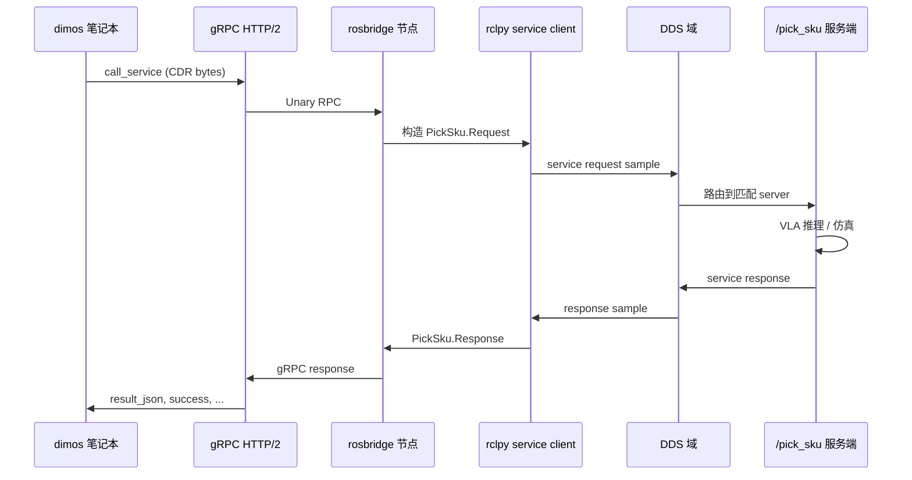
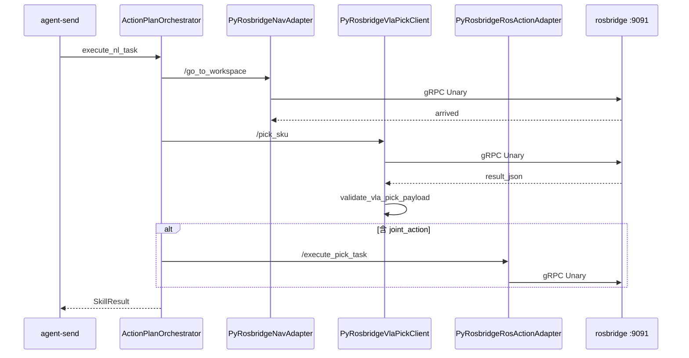

# gRPC 入门、ROS 2 DDS 与 rosbridge 实践

面向 **dimos VLA Pick 联调** 的系统教程：从 gRPC 原理 → ROS 2 内部 DDS → 本项目 `py_rosbridge` 全链路。

CLI 速查见 [`vla_pick_cli.md`](./vla_pick_cli.md)。

---

## 目录

1. [通信栈总览：你在哪一层](#1-通信栈总览你在哪一层)
2. [gRPC 详解](#2-grpc-详解)
3. [ROS 2 内部的 DDS 通信](#3-ros-2-内部的-dds-通信)
4. [三层对照：gRPC / ROS API / DDS](#4-三层对照grpc--ros-api--dds)
5. [本项目：dimos → rosbridge → Isaac](#5-本项目dimos--rosbridge--isaac)
6. [动手联调与排障](#6-动手联调与排障)
7. [学习路径与延伸阅读](#7-学习路径与延伸阅读)

---

## 1. 通信栈总览：你在哪一层

很多初学者会把 **gRPC**、**ROS**、**DDS** 混为一谈。先建立分层图：

```text
┌─────────────────────────────────────────────────────────────────┐
│  应用层：dimos agent、Isaac Sim 节点、导航/VLA 业务逻辑          │
├─────────────────────────────────────────────────────────────────┤
│  ROS 2 API：Node、Topic、Service、Action、参数、生命周期         │
├─────────────────────────────────────────────────────────────────┤
│  RMW 层：rcl / rclcpp / rclpy 与中间件之间的抽象                 │
├─────────────────────────────────────────────────────────────────┤
│  DDS 实现：Fast DDS / Cyclone DDS / Connext 等                   │
├─────────────────────────────────────────────────────────────────┤
│  网络/IPC：UDP 多播发现、TCP/UDP 数据传输、共享内存（同机优化）   │
└─────────────────────────────────────────────────────────────────┘

         dimos 笔记本                              远程 Isaac 机器
┌──────────────────────┐                    ┌──────────────────────┐
│ py_rosbridge         │      gRPC/TCP      │ rosbridge_grpc_server│
│ RosbridgeClient      │ ─────────────────► │                      │
│ (不在 ROS graph 里)  │      :9091         │ rclpy/rclcpp Node    │
└──────────────────────┘                    │         │            │
                                              │         ▼            │
                                              │   DDS 域内发现       │
                                              │         │            │
                                              │  /pick_sku 服务端    │
                                              │  /cmd_vel 订阅者 ... │
                                              └──────────────────────┘
```

**关键结论：**

- **dimos 本机不加入 ROS DDS 域**（VLA Pick 联调路径下）。它用 **gRPC** 连远程 rosbridge。
- **远程 Isaac 机器内部**，各 ROS 节点之间仍通过 **DDS** 通信；rosbridge 只是其中一个 ROS 节点，负责把外部 gRPC 请求「翻译」成 ROS 2 service call。
- dimos 框架 elsewhere 还支持 **LCM / SHM / 原生 ROS pubsub** 等 transport（见 `dimos/protocol/pubsub/`），与 VLA Pick 这条 gRPC 链路是不同场景。

---

## 2. gRPC 详解

### 2.1 gRPC 是什么

**gRPC** = **g**RPC **R**emote **P**rocedure **C**all（递归缩写）。

Google 开源的高性能 RPC 框架，底层默认跑在 **HTTP/2** 上，消息体用 **Protocol Buffers（protobuf）** 编码（也可换 JSON 等，但少见）。

可以把它理解成：

> 像调用本地函数一样，调用另一台机器上的函数；编译器/代码生成保证参数和返回值类型一致。

### 2.2 为什么不用 HTTP REST

| 维度 | HTTP REST（旧 VLA `:8018`） | gRPC |
|------|------------------------------|------|
| 协议 | HTTP/1.1 为主 | HTTP/2（多路复用、头部压缩） |
| 载荷 | JSON 文本 | protobuf 二进制（更小、更快） |
| 接口契约 | 文档约定，易漂移 | `.proto` / 代码生成，强类型 |
| 连接 | 常短连接 | 长连接 + 多 RPC 复用 |
| 流式 | 需 SSE/WebSocket 额外设计 | 原生四种 streaming 模式 |
| 浏览器 | 友好 | 需 grpc-web 代理 |

本项目弃用 HTTP VLA，改用 **rosbridge gRPC**：不是「gRPC 替代 ROS」，而是 **gRPC 作为跨机器入口**，内部仍走 ROS service。

### 2.3 HTTP/2 与 gRPC 的关系

gRPC 不是重新发明 TCP，而是规定 **HTTP/2 上怎么传 RPC**：

```text
Client                                    Server
   │                                         │
   │──── HTTP/2 CONNECT (建立连接) ──────────►│
   │                                         │
   │──── HEADERS :method=POST                │
   │            :path=/package.Service/Method│
   │            content-type=application/grpc│
   │──── DATA (protobuf 序列化的 request) ──►│
   │◄─── DATA (protobuf 序列化的 response) ──│
   │◄─── HEADERS grpc-status: 0 ─────────────│  ← 业务成功
```

要点：

- **一个 TCP 连接** 上可以并发多个 RPC（HTTP/2 stream）
- **grpc-status** 在 HTTP 层表示 RPC 是否成功（类似 HTTP 状态码，但是 gRPC 专用）
- 应用错误可以放在 response message 里（我们 ROS service 的 `success=false` 就是这类）

### 2.4 Protocol Buffers 深入一点

#### 语法示例

```protobuf
syntax = "proto3";

package dimos.vla;

message PickSkuRequest {
  string workspace_name = 1;
  string workspace_color = 2;
  string sku_name = 3;
  string sku_color = 4;
  string side = 5;
}

message PickSkuResponse {
  string command = 1;
  string status = 2;
  bool success = 3;
  string failure_reason = 4;
  string result_json = 5;
}

service VlaBridge {
  rpc PickSku(PickSkuRequest) returns (PickSkuResponse);
}
```

#### 字段编号与兼容性

- `= 1`、`= 2` 是 **field number**，序列化时靠编号识别字段，**不是默认值**
- 新增字段用新编号，老客户端可忽略未知字段 → **向后兼容**
- 不要复用已删除字段的编号

#### 和本项目的差异

我们 **没有手写上述 `.proto`**。`py_rosbridge` 用 ROS 的 `.srv` 定义 + **CDR codec**（`dax_dimos_interfaces_codecs.py`）完成等价工作：

```text
ROS .srv 定义  →  Python dataclass + MessageCodec  →  CDR 二进制  →  gRPC 载荷
```

CDR（Common Data Representation）是 OMG DDS 家族常用的序列化格式；ROS 2 消息在 DDS 层也是 CDR 布局。所以 **codec 对齐 `.srv` 字段顺序和类型** 至关重要。

### 2.5 四种 RPC 模式

| 模式 | 请求 | 响应 | 典型用途 |
|------|------|------|----------|
| **Unary** | 1 | 1 | 调 service，如 `/pick_sku` |
| **Server streaming** | 1 | N | 日志推送、分块下载 |
| **Client streaming** | N | 1 | 批量上传 |
| **Bidirectional streaming** | N | N | 实时双向数据 |

**VLA Pick 全部是 Unary**：一次请求，等一次响应（可能等 30s）。

### 2.6 Channel、Stub、Call 生命周期

```python
# 概念伪代码（标准 grpcio 风格）
channel = grpc.insecure_channel("10.69.6.121:9091")
stub = PickServiceStub(channel)
response = stub.PickSku(request, timeout=30.0)
```

| 概念 | 含义 | 本项目 |
|------|------|--------|
| **Channel** | 到 `host:port` 的连接池 | `RosbridgeClient(target)` |
| **Stub** | 生成的客户端代理 | `client.call_service(...)` |
| **Call** | 单次 RPC 上下文 | 一次 `call_service`  invocation |
| **Deadline** | 超时截止时间 | `timeout_sec` / `wait_timeout` |
| **Metadata** | 键值对头部（认证、tracing） | 多在 rosbridge 内部处理 |

#### Channel 状态（理解 `FutureTimeoutError`）

```text
IDLE → CONNECTING → READY → TRANSIENT_FAILURE → SHUTDOWN
```

- **`ready_timeout`**：等 Channel 变 **READY** 的最长时间（连不上 → `FutureTimeoutError`）
- **`timeout_sec`**：单次 service 业务执行超时
- **`wait_timeout`**：整个 gRPC 往返上限（应略大于 `timeout_sec`）

### 2.7 gRPC 错误 vs 业务错误

两层要分开看：

```text
┌─────────────────────────────────────────┐
│ gRPC 层：通道、序列化、网络                 │
│   grpc_success=False                    │
│   FutureTimeoutError / UNAVAILABLE      │
├─────────────────────────────────────────┤
│ rosbridge 转发层                         │
│   Stream removed (Socket closed)        │
├─────────────────────────────────────────┤
│ ROS service 业务层                       │
│   grpc_success=True, success=False      │
│   failure_reason / result_json          │
├─────────────────────────────────────────┤
│ dimos 校验层                             │
│   VLA_OUTPUT_INVALID / TARGET_MISMATCH  │
└─────────────────────────────────────────┘
```

### 2.8 标准 gRPC 工程流程（对照学习）

若写「纯 gRPC」微服务，典型步骤：

```bash
# 1. 写 .proto
# 2. 生成代码
python -m grpc_tools.protoc -I. --python_out=. --grpc_python_out=. vla.proto
# 3. 实现 Servicer
# 4. 启动 grpc.server
# 5. 客户端 stub 调用
```

本项目跳过 1–2 的 `.proto`，由 **ROS `.srv` + rosbridge-codegen** 生成 codec；Servicer 在 **远程 rosbridge** 里，dimos 只做 Client。

---

## 3. ROS 2 内部的 DDS 通信

> 注：DDS = **D**ata **D**istribution **S**ervice。ROS 2 默认用它做节点间通信。

### 3.1 为什么 ROS 2 选了 DDS

ROS 1 有自己的 TCPROS/UDPROS，中心化 master（`roscore`）做发现。

ROS 2 重写通信层，选中 **DDS** 作为底层，原因包括：

- **去中心化发现**：无需 roscore
- **QoS 可配置**：可靠性、历史、 durability 可按 topic 调
- **工业成熟**：航空航天、自动驾驶等领域已有实践
- **类型安全**：IDL 定义消息

你在 ROS 里写的：

```python
node.create_publisher(String, '/foo', 10)
node.create_subscription(String, '/foo', callback, 10)
node.create_service(PickSku, '/pick_sku', handler)
```

最终都会变成 **DDS 的 DataWriter / DataReader / Service 等实体**，由 **RMW**（ROS Middleware Interface）映射到具体 DDS 实现。

### 3.2 架构分层（RMW）

```text
你的 Python/C++ 代码 (rclpy / rclcpp)
        │
        ▼
   rcl  (ROS Client Library — 通用客户端库)
        │
        ▼
   rmw  (ROS Middleware Interface — 抽象接口)
        │
        ├── rmw_fastrtps    → eProsima Fast DDS
        ├── rmw_cyclonedds  → Eclipse Cyclone DDS
        └── rmw_connextdds  → RTI Connext
        │
        ▼
   DDS API (DCPS: DomainParticipant, Topic, Publisher, Subscriber...)
        │
        ▼
   UDP 多播 / UDP 单播 / TCP / 共享内存
```

查看当前机器用的哪套 RMW：

```bash
echo $RMW_IMPLEMENTATION
# 常见：rmw_fastrtps_cpp 或 rmw_cyclonedds_cpp
```

### 3.3 DDS 核心概念

| DDS 概念 | 类比 | ROS 2 对应 |
|----------|------|------------|
| **Domain** | 隔离的「通信小区」 | `ROS_DOMAIN_ID`（默认 0） |
| **DomainParticipant** | 进程级参与者 | 每个 ROS Node 底层关联 participant |
| **Topic** | 命名数据通道 | `/camera/image` 等 topic 名 + 类型 |
| **DataWriter** | 发布者 | `create_publisher` |
| **DataReader** | 订阅者 | `create_subscription` |
| **QoS** | 服务质量策略 | `QoSProfile(reliability=..., depth=...)` |
| **Discovery** | 自动发现对端 | SPDP/SEDP 协议，常走 UDP 多播 |

**Domain ID 必须一致** 才能互相看见。两台机器联调时，远程 Isaac 上所有相关节点的 `ROS_DOMAIN_ID` 要相同，且网络允许多播或配置了 peer discovery。

### 3.4 ROS 2 三种通信模式 vs DDS

#### Topic（发布/订阅，异步）

```text
Publisher ──► [DDS Topic] ──► Subscriber
              (可 N 对 M，单向、连续)
```

- 适合：相机流、里程计、TF、关节状态
- 语义：**发完即走**，不保证对方收到（取决于 QoS）
- dimos 若用原生 ROS transport（`dimos/protocol/pubsub/impl/rospubsub.py`），走的就是这条路径

#### Service（请求/响应，同步 RPC）

```text
Client ──request──► Server
Client ◄─response── Server
```

- 适合：`/pick_sku`、`/go_to_workspace` 等「调用一次、等结果」
- 底层 DDS 有 **RPC 风格** 映射；rclpy 表现为 blocking `call()` 或 async
- **VLA Pick 用的就是这种**（经 rosbridge 转发）

#### Action（带反馈的长任务）

```text
Client ──goal──► Server
Client ◄─feedback── Server  (多次)
Client ◄─result── Server
```

- 适合：导航 `nav2`、机械臂轨迹（可取消、可反馈进度）
- `/execute_pick_task` 在接口形态上接近 service；若远程实现为 action，要对应 adapter

### 3.5 QoS（服务质量）——ROS 开发者必知

ROS 2 的 QoS 是 **按 Topic 协商** 的：发布者和订阅者 QoS 不兼容则 **无法连接**（常见坑）。

主要维度：

| 策略 | 选项 | 含义 |
|------|------|------|
| **Reliability** | RELIABLE / BEST_EFFORT | 是否重传丢包 |
| **History** | KEEP_LAST / KEEP_ALL | 缓存几条 |
| **Depth** | 整数 | KEEP_LAST 时队列深度 |
| **Durability** | VOLATILE / TRANSIENT_LOCAL | 晚加入的订阅能否收到历史 |

示例（dimos ROS pubsub 默认倾向高吞吐）：

```python
QoSProfile(
    reliability=QoSReliabilityPolicy.RELIABLE,
    history=QoSHistoryPolicy.KEEP_LAST,
    durability=QoSDurabilityPolicy.VOLATILE,
    depth=5000,
)
```

**Service 的 QoS 由中间件内部处理**，日常调 service 较少手动配 QoS；**Topic 联调** 则要重点检查 QoS 匹配。

### 3.6 发现机制（Discovery）

ROS 2 节点启动后：

```text
1. 创建 DomainParticipant（指定 Domain ID）
2. 通过 UDP 多播（默认）广播「我有哪些 Topic/Service」
3. 其他 participant 收到后建立匹配的数据通道
4. 之后 DataWriter 发的样本路由到匹配的 DataReader
```

常见问题：

| 现象 | 可能原因 |
|------|----------|
| `ros2 topic list` 看不到对方 | Domain ID 不同、不同网络、防火墙挡多播 |
| 看得到 topic 无数据 | QoS 不兼容、类型名不一致 |
| 跨机不通 | 需 `FASTRTPS_DEFAULT_PROFILES` / Cyclone XML 配置 peer |

**dimos 笔记本上的 probe 脚本不依赖 DDS 发现**——它直接 gRPC 打到 rosbridge；但 **rosbridge 到 `/pick_sku` 服务端** 仍依赖远程 ROS DDS 图内发现。

### 3.7 序列化：CDR 与 ROS 消息

ROS 2 消息在 wire 上常用 **CDR** 编码（与 protobuf 不同）。

数据流：

```text
Python 对象 (PickSku.Request)
    → rosidl 生成的序列化
    → CDR 字节流
    → DDS 传输
    → 对端反序列化
```

`py_rosbridge` 的 `PickSkuRequestCodec` 必须与远程 **同一 `dax_dimos_interfaces/srv/PickSku` 定义** 一致，否则会出现：

- 解析乱码
- service 类型不匹配
- `Stream removed` 等转发错误

### 3.8 dimos 里的 DDS（与 VLA 链路的关系）

dimos 作为机器人框架，还有 **独立的 DDS transport**（Cyclone DDS Python 绑定）：

- 代码：`dimos/protocol/pubsub/impl/ddspubsub.py`
- 安装：`uv sync --extra dds`（见 `docs/usage/transports/dds.md`）
- 用途：模块间 pub/sub  benchmark、Unitree 等场景

这与 **VLA Pick 的 rosbridge gRPC** 是 **两条线**：

| 路径 | 何时用 |
|------|--------|
| **rosbridge gRPC** | 笔记本 dimos agent 调远程 Isaac ROS service |
| **dimos ROS pubsub** | dimos 进程作为 ROS 2 节点直接 pub/sub |
| **dimos DDS transport** | dimos 模块间直接用 Cyclone DDS，不经过 ROS API |
| **dimos LCM** | 本机/局域网模块通信（dimos 默认常见） |

### 3.9 远程 ROS 侧常用命令（理解 DDS 图）

在 **Isaac 那台机器** 上（不是 dimos 笔记本）：

```bash
# 当前 Domain
echo $ROS_DOMAIN_ID

# 看 DDS 图里有哪些 endpoint
ros2 node list
ros2 service list
ros2 service type /pick_sku

# 不经过 gRPC，直接在 ROS 图内测 service（隔离 rosbridge 问题）
ros2 service call /pick_sku dax_dimos_interfaces/srv/PickSku \
  "{workspace_name: 'table', workspace_color: 'blue', sku_name: 'cube', sku_color: 'red', side: ''}"

# 看 topic 是否有数据（DDS pub/sub）
ros2 topic list
ros2 topic echo /some_topic --once
```

推荐排障顺序：

```text
远程 ros2 service call 成功？
  ├─ 否 → 修 Isaac 节点 / DDS 域 / 接口包
  └─ 是 → 再测 dimos probe gRPC
           ├─ 否 → rosbridge / 网络 / codec
           └─ 是 → 查 dimos agent 逻辑
```

---

## 4. 三层对照：gRPC / ROS API / DDS

以一次 **`/pick_sku`** 为例，从头到尾：



| 层级 | 你看到的 API | 传输协议 | 典型地址/标识 |
|------|-------------|----------|---------------|
| dimos → rosbridge | `RosbridgeClient.call_service` | **gRPC over TCP** | `10.69.6.121:9091` |
| rosbridge → ROS 图 | `rclpy` service call | **DDS**（经 RMW） | `/pick_sku` + 类型名 |
| 节点间 topic 流 | `publish` / `subscribe` | **DDS** | `/joint_states` 等 |

**为什么跨机器不直接用 DDS？**

- DDS 跨公网/NAT 配置复杂（多播、防火墙、域发现）
- 团队已有 **rosbridge gRPC** 统一入口，dimos 无需安装完整 ROS 2 环境
- 仍保留 ROS 语义（service 名、`.srv` 类型），远程 Isaac 侧改动小

---

## 5. 本项目：dimos → rosbridge → Isaac

### 5.1 完整时序（含校验）



### 5.2 关键文件

| 层级 | 文件 | 职责 |
|------|------|------|
| 会话 | `skills/rosbridge_session.py` | `RosbridgeClient` 长连接 |
| 导航 | `skills/py_rosbridge_nav_adapter.py` | `/go_to_workspace` |
| 抓取 | `skills/py_rosbridge_vla_adapter.py` | `/pick_sku` |
| 执行 | `skills/py_rosbridge_ros_adapter.py` | `/execute_pick_task` |
| 接口 | `skills/srv/*.srv` | 与 `dax_dimos_interfaces` 对齐 |
| 编解码 | `skills/dax_dimos_interfaces_codecs.py` | CDR codec |
| 装配 | `skills/vla_pick_adapter_factory.py` | mock / py_rosbridge |
| 探针 | `scripts/probe_rosbridge_pick.py` | 分层测试 |

### 5.3 PickSku.srv 字段说明

```text
# Request
string workspace_name    # 如 table
string workspace_color   # 如 blue
string sku_name          # 如 cube
string sku_color         # 如 red
string side              # left / right / 空=auto
---
# Response
string command
string status
bool success             # ROS 业务是否成功
string failure_reason
string result_json       # 常含 joint_action、target_meta（JSON 字符串）
```

### 5.4 代码：一次 gRPC service 调用

```python
result = session.get_client().call_service(
    "/pick_sku",
    "dax_dimos_interfaces/srv/PickSku",
    pick_request,
    request_codec=PickSkuRequestCodec,
    response_codec=PickSkuResponseCodec,
    timeout_sec=30.0,       # 等 ROS 侧执行
    wait_timeout=31.0,      # 等整个 gRPC 往返
)
```

### 5.5 配置（`.env`）

```bash
VLA_PICK_ADAPTER=py_rosbridge
VLA_ROS_ADAPTER=py_rosbridge
VLA_SYS_NAV_ADAPTER=py_rosbridge
ROSBRIDGE_GRPC_TARGET=10.69.6.133:9091
ROSBRIDGE_READY_TIMEOUT_S=10
ROS_ACTION_TIMEOUT_S=30
```

---

## 6. 动手联调与排障

### 6.1 dimos 侧探针

```bash
cd ~/Projects/dimos && source .venv/bin/activate

.venv/bin/python scripts/probe_rosbridge_pick.py --step connect
.venv/bin/python scripts/probe_rosbridge_pick.py --step go_to_workspace
.venv/bin/python scripts/probe_rosbridge_pick.py --step pick_sku
.venv/bin/python scripts/probe_rosbridge_pick.py --step all
```

### 6.2 读输出

```text
pick_sku grpc_success=True success=True status='...' result_json_len=1234
```

| 信号 | 层级 | 下一步 |
|------|------|--------|
| `connect` 失败 / `FutureTimeoutError` | gRPC | `nc -zv 10.69.6.121 9091` |
| `grpc_success=True, success=False` | ROS 业务 | 看 `failure_reason`，远程 `ros2 service call` |
| `Stream removed` | rosbridge↔ROS | 远程 service 是否注册、类型是否一致 |
| agent `VLA_TARGET_MISMATCH` | dimos 校验 | 看 `result_json` 里 object 是否匹配 |

### 6.3 分层 checklist

```text
□ 9091 端口通（gRPC）
□ rosbridge 进程活着
□ ros2 service list 有 /pick_sku（DDS 图）
□ ros2 service call 本地成功（ROS 业务）
□ probe pick_sku 成功（gRPC + 转发）
□ dimos agent-send 成功（全链路）
```

### 6.4 常见错误速查

| 错误 | 层级 | 处理 |
|------|------|------|
| `FutureTimeoutError` | gRPC Channel | 远程 rosbridge、防火墙 |
| `Stream removed` | gRPC↔ROS 转发 | 重启 rosbridge、核对 srv 类型 |
| `VLA_UNAVAILABLE` | dimos 适配器 | 先 probe |
| `VLA_OUTPUT_INVALID` | dimos 校验 | `result_json` 缺字段 |
| topic 无数据 | DDS QoS | 对齐 reliability/history |
| 跨机 node 不可见 | DDS Domain | 统一 `ROS_DOMAIN_ID`、多播 |

---

## 7. 学习路径与延伸阅读

### 7.1 建议 5 天路径

| 天 | 内容 | 实践 |
|----|------|------|
| 1 | §1 总览 + §2 gRPC 概念 | 读 HTTP/2 / unary 流程 |
| 2 | §3 DDS + ROS 2 三种通信 | 远程 `ros2 service list/call` |
| 3 | §4–§5 全链路 | probe connect → pick_sku |
| 4 | 读 dimos 适配器源码 | `py_rosbridge_vla_adapter.py` |
| 5 | 标准 gRPC hello world | 对比「无 rosbridge」差异 |

### 7.2 官方文档

**gRPC**

- [Core concepts](https://grpc.io/docs/what-is-grpc/core-concepts/)
- [Lifecycle of a gRPC client](https://grpc.io/docs/guides/client-lifecycle/)
- [Protocol Buffers Proto3](https://protobuf.dev/programming-guides/proto3/)

**ROS 2 / DDS**

- [About ROS 2 middleware implementations](https://docs.ros.org/en/humble/Concepts/Advanced/Middleware-Implementations.html)
- [ROS 2 QoS](https://docs.ros.org/en/humble/Concepts/Intermediate/About-Quality-of-Service-Settings.html)
- [Understanding ROS 2 services](https://docs.ros.org/en/humble/Tutorials/Beginner-CLI-Tools/Understanding-ROS2-Services/Understanding-ROS2-Services.html)
- [Eclipse Cyclone DDS](https://cyclonedds.io/docs/cyclonedds/latest/)

**dimos 仓库**

- `docs/usage/transports/index.md` — LCM / ROS / DDS transport 抽象
- `docs/usage/transports/dds.md` — Cyclone DDS 安装
- [`vla_pick_cli.md`](./vla_pick_cli.md) — 命令速查

### 7.3 术语大表

| 术语 | 层 | 含义 | 本项目例子 |
|------|-----|------|------------|
| protobuf | gRPC | 二进制 IDL | rosbridge 内部；我们用 CDR+codec |
| Channel | gRPC | TCP 连接 | `RosbridgeClient("10.69.6.121:9091")` |
| Unary RPC | gRPC | 一发一收 | `call_service` |
| Deadline | gRPC | 超时 | `timeout_sec=30` |
| Node | ROS | 逻辑进程单元 | Isaac 上 pick 服务端 |
| Topic | ROS/DDS | 异步 pub/sub | 相机、关节状态 |
| Service | ROS/DDS | 同步 RPC | `/pick_sku` |
| Action | ROS | 长任务+反馈 | 导航（若用 nav2） |
| RMW | ROS | 中间件抽象 | fastrtps / cyclonedds |
| Domain ID | DDS | 通信域隔离 | `ROS_DOMAIN_ID=0` |
| QoS | DDS | 可靠性/历史 | topic 联调必查 |
| CDR | 序列化 | DDS wire 格式 | `PickSkuRequestCodec` |
| Discovery | DDS | 自动发现节点 | UDP 多播 |
| rosbridge | 桥接 | gRPC↔ROS | `:9091` |

---

## 8. 小结

1. **gRPC**：dimos 笔记本到远程 rosbridge 的 **跨机器 RPC 入口**（HTTP/2 + 二进制载荷）。
2. **ROS 2 Service**：rosbridge 在远程 ROS 图里调 `/pick_sku` 的 **业务 API**。
3. **DDS**：远程各 ROS 节点之间 **真实的 pub/sub 与 service 路由**，去中心化、QoS、CDR 序列化。
4. 排障永远 **由外向内**：gRPC → rosbridge 转发 → ROS service call → DDS 图 → 业务逻辑。
5. dimos 框架还有其他 transport（LCM/DDS/原生 ROS），VLA Pick 联调走的是 **py_rosbridge gRPC** 专线。

有问题时：先 [`vla_pick_cli.md`](./vla_pick_cli.md) 跑 probe，再对照本文 §3.9 在远程做 `ros2 service call`。
